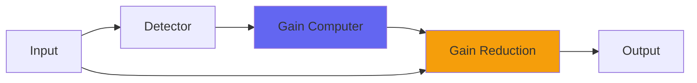

# PodcastDeluxe

## Quick Info

| | |
|---|---|
| **Category** | Dynamics |
| **Type** | Dynamics |
| **Status** | Latest Release |

## Description

a pile of compressors (curve style) and phase rotators

## Detailed Overview

PodcastDeluxe is the precursor to curve, along with its counterpart Podcast. Both of them have five curve-like compressors in series (slightly less refined), but PodcastDeluxe has five phase rotators and an ADClip-style output stage. The idea is that it would be radio station style processing. The reason it didn’t show up sooner is that it didn’t really work to my satisfaction. It’s still not perfect, but it’s different! I demonstrate it on house-type music, and on raw drums. It’s not really clean, not really dirty, not really squish-capable thanks to the curve-style compression (even five stages doesn’t give you ‘compression pumping’) but it’ll give a perhaps interesting, definitely processed-sounding effect.

Maybe you’ll like it on a mix because you’re not fussy about distorting, maybe you’ll find some useful place for it elsewhere. I think it’s got a knack for high-impact drum busses without distorting them too obviously. At any rate, there’s nothing quite like it. Enjoy!

## Signal Flow

## How It Works

PodcastDeluxe controls dynamics through peak control. The algorithm responds to your audio in a musical way, providing transparent to aggressive dynamic control.

## Usage Tips

- Start with gentle settings and increase as needed
- Use Dry/Wet for parallel compression if available
- Listen for pumping or artifacts
- A/B bypass to check if processing helps the mix

## Related Plugins

Browse other [Dynamics](../categories/dynamics.md) plugins.

## Technical Details

**Source Code**: [View on GitHub](https://github.com/airwindows/airwindows/tree/master/plugins/LinuxVST/src/PodcastDeluxe)

**Categories**: Dynamics

**Available Formats**:
- Mac AU
- Mac VST
- Windows VST
- Linux VST

## Resources

- [All Airwindows Plugins](../../README.md)
- [Category: Dynamics](../categories/dynamics.md)
- [Airwindows Website](https://www.airwindows.com)
- [Airwindows GitHub](https://github.com/airwindows/airwindows)

---

*Part of the Airwindows plugin collection - Open source audio processing plugins*

*Last updated: 2024*
