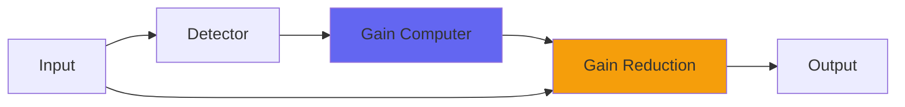

# Pop

## Quick Info

| | |
|---|---|
| **Category** | Dynamics |
| **Type** | Dynamics |
| **Status** | Stable |

## Description

a crazy overcompressor with a very exaggerated sound

## Detailed Overview

Why another compressor?

Yes, ‘because they all act and sound a little different’, but what’s the deal with this one in particular?

Pop was designed to be overstressed to get an effect like the Allen & Heath mini-limiter used on some 80s Genesis and Phil Collins songs: that huge attack, the way that little subtleties jump boldly out of the mix, the sheer squish and gnarl of it all. It wasn’t really about trying to model the specific gear so much as trying to get the effect, or more of the effect: I especially wanted the front end of sounds to burst through with enormous presence, but I also wanted to bring up little details out of the performance.

Pop’s a huge success at this. On some audio, I can get weird little reverb elements from the background to seem to hover up front even while loud stuff is being smashed. It’s designed to volume invert: the idea is if you’re hitting it with superloud things it can overcompensate and push the volume down extra far, letting you further exaggerate the effect.

As such, there are some sounds this just can’t do. If you try and get a huge thunderous smashed sound of it, it will just go super 80s and give you a loud attack and maybe even backwards decay, or some reinvention of the body of the sound. You have to set the level carefully to get the right sound happening, so it’s not terribly flexible: Pop is picky and you have to work it almost like it’s an instrument. It does run without latency, so in theory you could do like Phil did and track directly into it (or track into the DAW with it already present in the monitoring path) so you could modulate your singing intensity to work with it. That ought to work. Also remember a slapback echo, and to actually doubletrack!

If I can ever get the real preamp/compressor, I’ll study the heck out of it and do Pop 2. I’ll keep an eye out, as that would be really rewarding work and I could probably get closer to the real thing with that kind of reference :)

## Signal Flow

## How It Works

Pop controls dynamics through peak control. The algorithm responds to your audio in a musical way, providing transparent to aggressive dynamic control.

## Usage Tips

- Start with gentle settings and increase as needed
- Use Dry/Wet for parallel compression if available
- Listen for pumping or artifacts
- A/B bypass to check if processing helps the mix

## Related Plugins

Browse other [Dynamics](../categories/dynamics.md) plugins.

## Technical Details

**Source Code**: [View on GitHub](https://github.com/airwindows/airwindows/tree/master/plugins/LinuxVST/src/Pop)

**Categories**: Dynamics

**Available Formats**:
- Mac AU
- Mac VST
- Windows VST
- Linux VST

## Resources

- [All Airwindows Plugins](../../README.md)
- [Category: Dynamics](../categories/dynamics.md)
- [Airwindows Website](https://www.airwindows.com)
- [Airwindows GitHub](https://github.com/airwindows/airwindows)

---

*Part of the Airwindows plugin collection - Open source audio processing plugins*

*Last updated: 2024*
