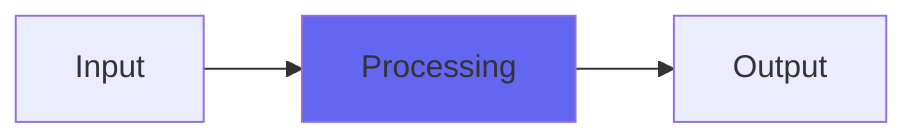

# PowerSag

## Quick Info

| | |
|---|---|
| **Category** | Effects |
| **Type** | Effects |
| **Status** | Stable |

## Description

for emulating power supply limitations in analog modeling

## Detailed Overview

We’re going to explore the early Desk plugins (as free VSTs), so here we’ll start off with one of the underlying principles! PowerSag models the problem of analog power supplies that can’t source enough current to drive the output of the circuit. The circuit doesn’t directly distort, but the more output it’s been making, the less is in reserve. This is part of the Desk line of plugins, but now it’s a distinct component to play with.

You get a Depth and Speed control. Dial in the effect by exaggerating Depth and then exploring with Speed: it’ll create a variety of compressey or distortey effects, but since they’re sucking energy out of the body of the sound, it’s a completely different type of distortion from saturation or clipping. Then, return Depth to zero and sneak small amounts of it back in, until the desired effect is reached. You’ll get a more tubey effect with extremely slow Speed, a big-console transistory effect with very quick Speed.

The neat thing about PowerSag is that, if you like grunge and distortion, it’s capable of adding some grind to the sound while pulling the channel back in the mix, where traditional distortion and saturation pushes sounds forward. When you balance that with normal overdrive, you can get a lot of energy and character happening without everything becoming too fatiguing and up-front. Balance is good, being able to trim the body of a sound is good: if you like sculpting mixes with distortion and saturation, this might be right up your alley :)

## Signal Flow

## How It Works

PowerSag processes audio in the Effects category. See the description above for specific functionality.

## Usage Tips

- Start with conservative settings
- A/B compare to hear the effect clearly
- Use in context with other processing
- Trust your ears over visual meters

## Related Plugins

Browse other [Effects](../categories/effects.md) plugins.

## Technical Details

**Source Code**: [View on GitHub](https://github.com/airwindows/airwindows/tree/master/plugins/LinuxVST/src/PowerSag)

**Categories**: Effects

**Available Formats**:
- Mac AU
- Mac VST
- Windows VST
- Linux VST

## Resources

- [All Airwindows Plugins](../../README.md)
- [Category: Effects](../categories/effects.md)
- [Airwindows Website](https://www.airwindows.com)
- [Airwindows GitHub](https://github.com/airwindows/airwindows)

---

*Part of the Airwindows plugin collection - Open source audio processing plugins*

*Last updated: 2024*
