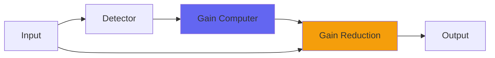

# Pressure4

## Quick Info

| | |
|---|---|
| **Category** | Dynamics |
| **Type** | Dynamics |
| **Status** | Stable |

## Description

a compressor adjustable between vari-mu and ‘new york’ peak-retaining behaviors

## Detailed Overview

What can I even say? This is the golden ear favorite. Version 4 brings new functionality that has never existed in Pressure before: the stereo version (default for VST, and the Audio Unit that doesn’t specifically say ‘Mono’) uses a special linked mode based on diade bridges in hardware compressors. That’s not to say that it is ‘analog modeling’ because it isn’t. From the beginning, Pressure has been made out of a lucky algorithm with a particular organic, pleasing quality, and part of Pressure4 is knowing what to strip down, how to simplify that algorithm until it lets all the music through.

But then, when you explore the way Pressure4 squishes up depending on how hard you drive it, and then start listening to the textures of different speed control settings and what that does, and then begin exploring what the ‘µ-iness’ control does… and it turns out that each one of those things gives specific and controllable shapings of the sound, but in ways very difficult to put into words, yet you can learn what it does and make the plugin do what you intend even if it’s tough to articulate exactly what you’re going for…

This is why we turn to odd little tools like this. The whole character of Pressure4 can change with tiny adjustments of the controls. It can do about twelve wholly distinct things when set up right, but they’re all inherent in that one curiously simple, but chaotically strange, algorithm. And now the linked stereo form of Pressure does all that with a naturalness and fluidity never before seen with this plugin.

## Signal Flow

## How It Works

Pressure4 controls dynamics through compression. The algorithm responds to your audio in a musical way, providing transparent to aggressive dynamic control.

## Usage Tips

- Start with gentle settings and increase as needed
- Use Dry/Wet for parallel compression if available
- Listen for pumping or artifacts
- A/B bypass to check if processing helps the mix

## Related Plugins

Browse other [Dynamics](../categories/dynamics.md) plugins.

## Technical Details

**Source Code**: [View on GitHub](https://github.com/airwindows/airwindows/tree/master/plugins/LinuxVST/src/Pressure4)

**Categories**: Dynamics

**Available Formats**:
- Mac AU
- Mac VST
- Windows VST
- Linux VST

## Resources

- [All Airwindows Plugins](../../README.md)
- [Category: Dynamics](../categories/dynamics.md)
- [Airwindows Website](https://www.airwindows.com)
- [Airwindows GitHub](https://github.com/airwindows/airwindows)

---

*Part of the Airwindows plugin collection - Open source audio processing plugins*

*Last updated: 2024*
