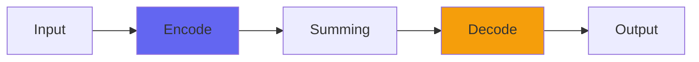

# PurestConsole2Channel

## Quick Info

| | |
|---|---|
| **Category** | Consoles |
| **Type** | Consoles |
| **Status** | Stable |

## Description

the distributed filter version of PurestConsole

## Detailed Overview

Meet PurestConsole2.

This serves a special purpose in modern Airwindows Console mixes. I’ve got Console7, which gives you all the glue you could want, creates solidity and the sense of an analog mixing desk (all the more if you use Console7Cascade, which I’m avoiding for this track and this video). But Console7 does its aliasing prevention by rolling off right at 20k, which helps the sense of glue but steps on some of the super-sparkly treble you sometimes get in modern mixes. It’s set up to do it really gracefully, but some have noticed a diminishing of super-glittery highs.

PurestConsole was always the ‘colorless, transparent’ take on any Console system, but with PurestConsole2 we’re stepping just a bit away from that, to serve as a complement to Console7. PurestConsole2 does the same ‘filter the super-highs to prevent aliasing’ thing that Console7 does. BUT, not quite the same. It starts higher (run it at 44 or 48k and it won’t even attempt to filter) to extend to 30k before filtering. But then it filters SHARPER… to roll off quicker. And in doing that, it gives you a presence peak beyond hearing. Not a huge one, but it’s there: it’s also on the end of the system, not (like Console7) going into the system. So PurestConsole2 gives you a sprinkling of treble glitter even while it rolls off the aliasing-prone frequencies more effectively.

The end result is the same kind of analog warmth… except it’s a cool, airy clarity that resolves absolutely EVERYTHING. If you’re shooting for super-clear this is the one you want. And since Console mixes can drive submixes which then use another Console system to sum the stems to the 2-buss… you can sneak it in on your harmony vocal beds, or orchestral stems, or you could use Console7 for everything and then sum only the stems to the 2-buss using PurestConsole2. Instead of mixing and matching within the summing busses, design your mix structure by figuring out where you want analog fatness and slam, and where you want clarity and resolution.

## Signal Flow

## How It Works

PurestConsole2Channel is part of the Airwindows Console system. Use the Channel version on tracks and the Buss version on the master to create a unique summing environment that adds space and dimension to your mix.

## Usage Tips

- Use matching Channel and Buss plugins (don't mix versions)
- Start with settings at 0.5 (neutral)
- Place Channel on all important tracks
- Place Buss on master fader only

## Related Plugins

Browse other [Consoles](../categories/consoles.md) plugins.

## Technical Details

**Source Code**: [View on GitHub](https://github.com/airwindows/airwindows/tree/master/plugins/LinuxVST/src/PurestConsole2Channel)

**Categories**: Consoles

**Available Formats**:
- Mac AU
- Mac VST
- Windows VST
- Linux VST

## Resources

- [All Airwindows Plugins](../../README.md)
- [Category: Consoles](../categories/consoles.md)
- [Airwindows Website](https://www.airwindows.com)
- [Airwindows GitHub](https://github.com/airwindows/airwindows)

---

*Part of the Airwindows plugin collection - Open source audio processing plugins*

*Last updated: 2024*
