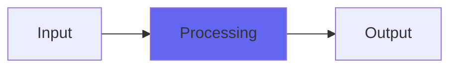

# PurestEcho

## Quick Info

| | |
|---|---|
| **Category** | Ambience |
| **Type** | Ambience |
| **Status** | Latest Release |

## Description

optimized Airwindows echo with exactly four evenly spaced taps on tap

## Detailed Overview

PurestEcho gives you four echoes, sample-averaged to deliver extremely precise timing, each with its own tap. That means you can use it as a delay line and set up discrete echoes which then stop completely: no feedback, only a series of trailing echoes which then get out of the way and don’t mud up your mix. Or you can use it for just a single slapback (use the last, for the longest delay time). Or, you can set up odd effects like increasing volume slapbacks, or use of only certain taps.

Or, you can get a tone that’s part of the 90s: turn all the delay taps on full and then set the delay time really short. You’ll find there’s a tightly controlled pipe-like honk that emphasizes a musical tone… sort of a Dalek-like robot-like thing… and you can play this using the slider. Note: this slider is NOT smoothed, because it’s smashing the buffer anyway, but more importantly if you’re programming in a bassline using this effect you’d need it to abruptly switch frequencies. So think of it as something you’d play via control automation, not so much through live entry on the slider.

Between that and the ability to throw a big rich echo that fakes ‘feedback’ but then gets right out of the way, I think PurestEcho will find its way into peoples’ workflows. I hope you like it :)

## Signal Flow

## How It Works

PurestEcho processes audio in the Ambience category. See the description above for specific functionality.

## Usage Tips

- Start with conservative settings
- A/B compare to hear the effect clearly
- Use in context with other processing
- Trust your ears over visual meters

## Related Plugins

Browse other [Ambience](../categories/ambience.md) plugins.

## Technical Details

**Source Code**: [View on GitHub](https://github.com/airwindows/airwindows/tree/master/plugins/LinuxVST/src/PurestEcho)

**Categories**: Ambience

**Available Formats**:
- Mac AU
- Mac VST
- Windows VST
- Linux VST

## Resources

- [All Airwindows Plugins](../../README.md)
- [Category: Ambience](../categories/ambience.md)
- [Airwindows Website](https://www.airwindows.com)
- [Airwindows GitHub](https://github.com/airwindows/airwindows)

---

*Part of the Airwindows plugin collection - Open source audio processing plugins*

*Last updated: 2024*
