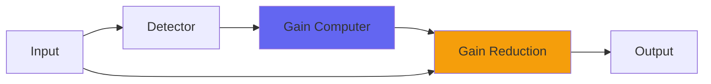

# PurestSquish

## Quick Info

| | |
|---|---|
| **Category** | Dynamics |
| **Type** | Dynamics |
| **Status** | Latest Release |

## Description

an open-sounding compressor with bass bloom

## Detailed Overview

PurestSquish is a compressor, with its own sound. In the video I compare it to Pressure4, Logical4, and SurgeTide, and also show how it can be used in conjunction with SurgeTide (a real ‘sleeper’ plugin not easily understood) to produce amazingly transparent dynamics control. That said, this is not at all a normal compressor plugin and won't act normal.

I also spent some time torturing it with sine sweeps, showing how Pressure and Logical are more like ‘analog emulations’ and produce harmonics, while PurestSquish instead does a weird thing when you turn off and on signal generators. So if you’re looking for ways to say ‘this is broken forever!’ watch those parts of the video :)

If this doesn’t worry you, PurestSquish also has a bass bloom control that lets you pass subsonics or bass notes through uncompressed, to taste. If it does worry you, chalk it up to PurestSquish running simultaneous two-and-three-sample-interleaved compressors, much like Capacitor runs two-and-three-sample-interleaved filters, and use one of the other compressors I’ve put out, perhaps one of the three also featured in the PurestSquish video.

## Signal Flow

## How It Works

PurestSquish controls dynamics through peak control. The algorithm responds to your audio in a musical way, providing transparent to aggressive dynamic control.

## Usage Tips

- Start with gentle settings and increase as needed
- Use Dry/Wet for parallel compression if available
- Listen for pumping or artifacts
- A/B bypass to check if processing helps the mix

## Related Plugins

Browse other [Dynamics](../categories/dynamics.md) plugins.

## Technical Details

**Source Code**: [View on GitHub](https://github.com/airwindows/airwindows/tree/master/plugins/LinuxVST/src/PurestSquish)

**Categories**: Dynamics

**Available Formats**:
- Mac AU
- Mac VST
- Windows VST
- Linux VST

## Resources

- [All Airwindows Plugins](../../README.md)
- [Category: Dynamics](../categories/dynamics.md)
- [Airwindows Website](https://www.airwindows.com)
- [Airwindows GitHub](https://github.com/airwindows/airwindows)

---

*Part of the Airwindows plugin collection - Open source audio processing plugins*

*Last updated: 2024*
