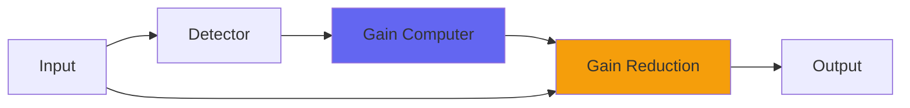

# Pyewacket

 

## Quick Info

| | |
|---|---|
| **Category** | Dynamics |
| **Type** | Dynamics |
| **Status** | Latest Release |

## Description

an old school compressor for high definition transients. Adds no fatness, just energy

## Detailed Overview

Pyewacket is a strange beast. It’s inspired by how much I love the 60s/70s recordings out of London’s Olympic Studios, which had and used Pye compressors on many of my favorite classic and prog-rock records. Once you recognize the sound, nothing else will do: the musical event is delineated with hallucinatory intensity.

Mind you, for ten or twenty THOUSAND dollars it had damn well better hallucinate musical events on command: these are not compressors normal people can have, not anymore.

However, I’m ‘chris from airwindows’, so for me it’s not just a matter of mimicking the faceplate or even the specific behaviors of the device. I want something more original, that can get the essence of that electrifying sound. I might not play like a musical hero, but I want a compressor that can deliver that crackling voltage. And as I was listening to examples of a homebrew Pye replica, it suddenly hit me: I know how to make a compressor cut back just the body of the sound, leaving that energy and transient definition. I can also bring in the ‘brickwall filter’ behavior the Pyes have, as needed. And I have a whole life of devoted music listening off classic vinyl records to guide me. I can get the sound.

Introducing Pyewacket. Pyewacket is my compressor familiar. It may or may not have dark magic, but what it does have (demonstrated at the end of my video) is a response and tonality like no compressor you’ve heard. I can contrast it with Pressure4, and have done: where a more ’round and thick’ comp like Pressure4 brings stuff forward, Pyewacket’s soundstage sits back and the energy comes forward, from the highest treble to deep hard-kicking bass, producing a ‘retro’ sound where peak energy absolutely blows away the more thick, tubby RMS loudness. This is a compressor for a new era. We’ve been doing ‘loud and fat’ for decades now, and the loudness war is on its last legs, with automatic playback gain controls rendering it useless. You don’t have to be composing retro to use this. The only requirement is energy and information: whether as a 2-buss comp or to condition individual tracks, Pyewacket brings focus and intensity, and an incredibly clear and articulate attack transient where most compressors mangle and transform the attack beyond recognition.

And if you try really hard, yes you can kinda-sorta make it do that ‘Hole In My Shoe’ gratituous pumping thing. Rest assured, though: you probably shouldn’t.

Other people can’t do this plugin. You can’t market it in normal ways because it doesn’t do ‘BIG PHAT THICK PHWOAARRR’, you don’t switch it in and have all the music leap forward and become much bigger and in fact it might make things smaller, and an inexperienced kid with softsynths and Apple Loops might think something was amiss and be extremely uninspired. And anyone trying to tie it to the twenty thousand dollar unattainable hardware compressor would be compelled to model every little detail of the very complex and twitchy hardware unit, and that would cause that plugin to be overprocessed and it’d lose most of what made it special.

But Pyewacket is important, because it’s the sort of thing I can do when supported by Patreon. I don’t have to restrict myself to what’s going to sell to blind market forces. I can make it the essence of how Airwindows would do this sound, and I have done. As such, it is free in AU, Mac and PC VST form. If I’m poorer than you (go check on the Patreon and see, I get paid monthly) then it might be worth your while to chip in a buck a month (or more if you like).

I really, really, really like this one, and maybe you will too :)

## Signal Flow

## How It Works

Pyewacket controls dynamics through peak control. The algorithm responds to your audio in a musical way, providing transparent to aggressive dynamic control.

## Usage Tips

- Start with gentle settings and increase as needed
- Use Dry/Wet for parallel compression if available
- Listen for pumping or artifacts
- A/B bypass to check if processing helps the mix

## Related Plugins

Browse other [Dynamics](../categories/dynamics.md) plugins.

## Technical Details

**Source Code**: [View on GitHub](https://github.com/airwindows/airwindows/tree/master/plugins/LinuxVST/src/Pyewacket)

**Categories**: Dynamics

**Available Formats**:
- Mac AU
- Mac VST
- Windows VST
- Linux VST

## Resources

- [All Airwindows Plugins](../../README.md)
- [Category: Dynamics](../categories/dynamics.md)
- [Airwindows Website](https://www.airwindows.com)
- [Airwindows GitHub](https://github.com/airwindows/airwindows)

---

*Part of the Airwindows plugin collection - Open source audio processing plugins*

*Last updated: 2024*
