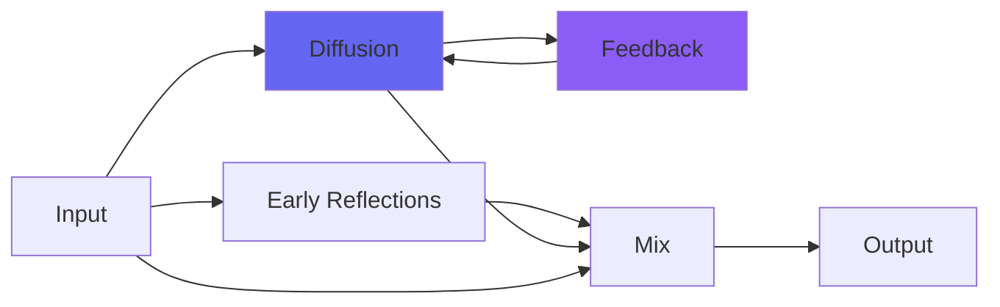

# Reverb

## Quick Info

| | |
|---|---|
| **Category** | Reverb |
| **Type** | Reverb |
| **Status** | Stable |

## Description

simplified and tuned MatrixVerb, adjusting everything for each optimum verb size

## Detailed Overview

In some ways I think this is even better, but I know people like to fiddle with knobs, so MatrixVerb had to go first. And yet…

Reverb is my new go-to reverb. Why? Because it takes all the interactivity of MatrixVerb and boils it down to ONE slider, and a dry/wet. It does all the same things: centered sounds spread, there’s a subtle detune as if sound was passing through temperature differences in the room, high frequency stuff falls away accurate to the sound of real air in reference concrete cavern recordings: it IS MatrixVerb, in every detail. Except it’s adapting all of that, on the fly, to best suit whatever size of reverb space you seek. Think in terms of ‘bigness’ and just go: if things are too cavernous, get smaller, if they’re not reverberant enough get bigger. Reverb always does its best for whatever size of space you’re making. If you need to get crazier, MatrixVerb still exists. You’ll get results faster with Reverb… so much so, that I’ve replaced MV in the Airwindows Starter Kit with Reverb. That’s how much I like it: it’s the space-maker I would show newcomers first, the most approachable way to audio ambience.

(followup: subsequent reverbs like Verbity, Galactic and Chamber employed a feedforward configuration and got a richer sound. Reverb and Matrixverb turn out to be the 'plugin-style' reverb options, which is not to say they can't be useful too)

## Signal Flow

## How It Works

Reverb creates spatial effects through algorithmic reverb. Use it to add depth, space, and dimension to your tracks.

## Usage Tips

- Less is often more - start conservative
- Use pre-delay for clarity
- EQ the reverb return (cut lows, sometimes highs)
- Match decay time to song tempo

## Related Plugins

Browse other [Reverb](../categories/reverb.md) plugins.

## Technical Details

**Source Code**: [View on GitHub](https://github.com/airwindows/airwindows/tree/master/plugins/LinuxVST/src/Reverb)

**Categories**: Reverb

**Available Formats**:
- Mac AU
- Mac VST
- Windows VST
- Linux VST

## Resources

- [All Airwindows Plugins](../../README.md)
- [Category: Reverb](../categories/reverb.md)
- [Airwindows Website](https://www.airwindows.com)
- [Airwindows GitHub](https://github.com/airwindows/airwindows)

---

*Part of the Airwindows plugin collection - Open source audio processing plugins*

*Last updated: 2024*
