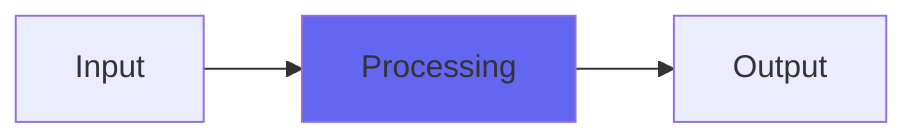

# SampleDelay

## Quick Info

| | |
|---|---|
| **Category** | Ambience |
| **Type** | Ambience |
| **Status** | Latest Release |

## Description

three delays combined: millisecond, sample and subsample

## Detailed Overview

SampleDelay is a very simple thing, implemented in a particular way. It's not exactly an echo (though it can be), not exactly a timing adjustment tool, not exactly a sound shaper… more like, a little of all of those things.

You've got up to 100 milliseconds of delay on the first control. On the second, you have 0 to 10 samples of delay, exactly. And on the third control, you have zero to one sample: you have a subsample trim. They all work separately and combine into a single delay, with an inverse/dry/wet control on the fourth slider.

Why? Why like this?

Sure, you can use part-dry and part-wet for a single slapback echo. Sure, you could set it to half-inverse and have total cancellation and make a comb-filter effect, or set it full wet… or full inverse… for a small timing adjustment on a multimiked setup.

But let's consider that multimike setup. Suppose we're trying to get a snare mike in phase with nearby overheads. Well, one thing we could do is isolate the snare mic with an overhead, and set the snare to fully inverse (assuming the mic's phase isn't also flipped…) and dial in the timing to cancel as much as possible. Then, go to the opposite (inverse or wet) and you have your fully in phase signal.

Same with multimiked guitar cabs. Find the beef by canceling it and then flipping from inverse to wet (or vice versa)

Or, go for effect and have the spot mike stay inverted and don't bring it up as much, and it'll make things more bright and complex… or put it slightly off for a tonal shift. Three separately adjustable delay ranges down to the finest you could have, and the one inv/wet control to let you quickly do whatever you want.

There's a reason I've been asked to bring this one back. Hope you like it. For some this will be a very boring effect. For others… not :)

## Signal Flow

## How It Works

SampleDelay processes audio in the Ambience category. See the description above for specific functionality.

## Usage Tips

- Start with conservative settings
- A/B compare to hear the effect clearly
- Use in context with other processing
- Trust your ears over visual meters

## Related Plugins

Browse other [Ambience](../categories/ambience.md) plugins.

## Technical Details

**Source Code**: [View on GitHub](https://github.com/airwindows/airwindows/tree/master/plugins/LinuxVST/src/SampleDelay)

**Categories**: Ambience

**Available Formats**:
- Mac AU
- Mac VST
- Windows VST
- Linux VST

## Resources

- [All Airwindows Plugins](../../README.md)
- [Category: Ambience](../categories/ambience.md)
- [Airwindows Website](https://www.airwindows.com)
- [Airwindows GitHub](https://github.com/airwindows/airwindows)

---

*Part of the Airwindows plugin collection - Open source audio processing plugins*

*Last updated: 2024*
