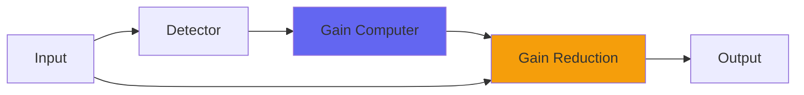

# SoftGate

 

## Quick Info

| | |
|---|---|
| **Category** | Dynamics |
| **Type** | Dynamics |
| **Status** | Latest Release |

## Description

a gate that can mute hiss and smooth sample tails

## Detailed Overview

Hi! Today’s Airwindows tool is for sample makers (though you could use in in a mix if you really wanted to, or abuse it for special effects). It’s called SoftGate.

The purpose of SoftGate is this: you can set it so it’ll take the noise floor of a recording that you want to turn to samples (or multisamples), and fade it into darkness. You can set it to do this quickly, or quite slowly. This will clean up the noise floor of your multisample instruments and let you sustain things for longer, whatever the source recording quality is: if it’s real noisy and all your samples fade into a bunch of ugly noise, tell SoftGate to fade more slowly (lower on the slider) and allow that to kick in as the sound fades away into what’s supposed to be silence.

Or, if it’s a good effect but you don’t need to produce that much gating, use the bottom fader to bring in the raw signal again and balance that with the processed one, to get the right kind of fade.

The Audio Unit comes in SoftGate and SoftGateMono, because it’s inherently a linked stereo plugin (so stereo image doesn’t wander as it fades). You can use those on mono tracks in VST, but in AU you’re not supposed to run a stereo plugin on a mono source… so SoftGateMono exists to cover non-stereo tracks. If you use it on a stereo track it’ll gate Left and Right separately, so be warned. Also, SoftGateMono is technically ‘N to N’, like many of my AUs that aren’t stereo or stereo linked, so like many of my AUs you can also use it on quad, 5.1 or 7.1 tracks (did you know you could do that? Have fun, surround mixers).

## Signal Flow

## How It Works

SoftGate controls dynamics through peak control. The algorithm responds to your audio in a musical way, providing transparent to aggressive dynamic control.

## Usage Tips

- Start with gentle settings and increase as needed
- Use Dry/Wet for parallel compression if available
- Listen for pumping or artifacts
- A/B bypass to check if processing helps the mix

## Related Plugins

Browse other [Dynamics](../categories/dynamics.md) plugins.

## Technical Details

**Source Code**: [View on GitHub](https://github.com/airwindows/airwindows/tree/master/plugins/LinuxVST/src/SoftGate)

**Categories**: Dynamics

**Available Formats**:
- Mac AU
- Mac VST
- Windows VST
- Linux VST

## Resources

- [All Airwindows Plugins](../../README.md)
- [Category: Dynamics](../categories/dynamics.md)
- [Airwindows Website](https://www.airwindows.com)
- [Airwindows GitHub](https://github.com/airwindows/airwindows)

---

*Part of the Airwindows plugin collection - Open source audio processing plugins*

*Last updated: 2024*
