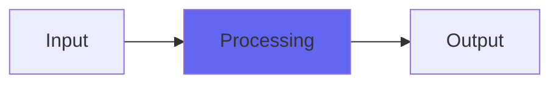

# SpatializeDither

## Quick Info

| | |
|---|---|
| **Category** | Dithers |
| **Type** | Dithers |
| **Status** | Stable |

## Description

a high-performance clarity and accuracy dither

## Detailed Overview

Spatialize is one of my high-performance boutique dithers. Though I think my Naturalize beats it, that’s a preference: I like digital sound to sound organic and real, and I like ambience and foggy distance and other things Naturalize is great at emphasizing.

Spatialize is also good at reverb depths and softness, but what it excels at is focus.

This modified dither algorithm has opinions about what ought to be randomized. Any normal dither (especially a technically correct TPDF-based one, such as PaulDither, TapeDither or NodeDither that can encompass either) has no preferences about what samples it gets. It will apply noise regardless, with perfect impartiality.

Spatialize (which I’ve also termed Contingent Dither, early in its development) isn’t like that. It says, ‘hey, this sample is exactly on a quantization value. No way am I going to mess that up, it’s staying right where it is!’. Or, it says ‘this sample is exactly between two quantization values. If I rapidly flip between adjacent values I can try to get the DAC to produce output between them. What could go wrong?’. Or, it says ‘this sample is none of the above, let’s bring in some randomness and apply dither like some normal plugin that isn’t crazy, would do’.

Or all of the above, blended…

That’s how Spatialize works. These are pretty bold things to try to do, especially the attempt to balance between two quantization values: that’s not really a reasonable thing to try, even when blended with random noise. And it pays something of a price: while Spatialize is quiet in its noise generation even without resorting to noise shaping, its behavior down around the noise floor isn’t perfectly well-behaved.

But that’s a trade-off, because by sacrificing this good behavior, Spatialize gets to be very sure that when samples hit perfectly on quantization boundaries, they’ll be accurately represented. And the bit-flippiness of the exactly-between behavior gives rise to a really strong highpassy effect that heightens treble energy. The result is a dither with a holographic, intense sonic reality to it: and it IS reality, because it comes out of this determination to honor the true values of the samples wherever possible. Spatialize is always prepared to abandon ‘appropriate’ noise floor behavior if it can nail down the sonic envelope with more ruthless accuracy.

So, if you’re into the hyper-real, high-definition sound of extreme clarity and accuracy, Spatialize might be your preferred Airwindows boutique dither. And, since it does it all with no noise shaping, there’s still an ease and naturalness to the resulting sound. It’s probably my own favorite apart from Naturalize, and for some things I prefer it. And, it’s free, AU and VST. :)

## Signal Flow

## How It Works

SpatializeDither processes audio in the Dithers category. See the description above for specific functionality.

## Usage Tips

- Start with conservative settings
- A/B compare to hear the effect clearly
- Use in context with other processing
- Trust your ears over visual meters

## Related Plugins

Browse other [Dithers](../categories/dithers.md) plugins.

## Technical Details

**Source Code**: [View on GitHub](https://github.com/airwindows/airwindows/tree/master/plugins/LinuxVST/src/SpatializeDither)

**Categories**: Dithers

**Available Formats**:
- Mac AU
- Mac VST
- Windows VST
- Linux VST

## Resources

- [All Airwindows Plugins](../../README.md)
- [Category: Dithers](../categories/dithers.md)
- [Airwindows Website](https://www.airwindows.com)
- [Airwindows GitHub](https://github.com/airwindows/airwindows)

---

*Part of the Airwindows plugin collection - Open source audio processing plugins*

*Last updated: 2024*
