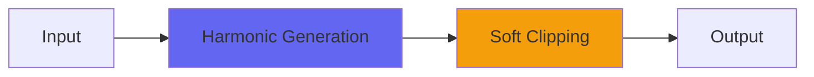

# Spiral2

## Quick Info

| | |
|---|---|
| **Category** | Saturation |
| **Type** | Saturation |
| **Status** | Latest Release |

## Description

Spiral with controls including Presence

## Signal Flow

## How It Works

Spiral2 processes audio in the Saturation category. See the description above for specific functionality.

## Usage Tips

- Start with conservative settings
- A/B compare to hear the effect clearly
- Use in context with other processing
- Trust your ears over visual meters

## Related Plugins

Browse other [Saturation](../categories/saturation.md) plugins.

## Technical Details

**Source Code**: [View on GitHub](https://github.com/airwindows/airwindows/tree/master/plugins/LinuxVST/src/Spiral2)

**Categories**: Saturation

**Available Formats**:
- Mac AU
- Mac VST
- Windows VST
- Linux VST

## Resources

- [All Airwindows Plugins](../../README.md)
- [Category: Saturation](../categories/saturation.md)
- [Airwindows Website](https://www.airwindows.com)
- [Airwindows GitHub](https://github.com/airwindows/airwindows)

---

*Part of the Airwindows plugin collection - Open source audio processing plugins*

*Last updated: 2024*
