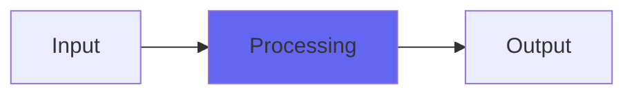

# Srsly

## Quick Info

| | |
|---|---|
| **Category** | Stereo |
| **Type** | Stereo |
| **Status** | Stable |

## Description

a psychoacoustic stereo processor

## Detailed Overview

People get really excited sometimes, so here’s a failure :)

Srsly is meant to do what a Hughes SRS processor does. That’s an obscure stereo widener actually made by Howard “Spruce Goose” Hughes’ company. I tackled it because a musician I love, Chad Clark, needs one ‘cos his is broken and not in proper working order. Hence, the need for somebody to try and do a plugin version. So I tried, with some pictures out of Popular Mechanics and a single cruddy youtube video to be my guide (this thing is OBSCURE) and I have not succeeded. Whatever the real one sounds like, this ain’t it.

But it does a thing, and I’ve added a Q control to help get it to do useful things since I can’t tell what’s right or wrong for this stuff, and this is as far as I can carry it right now. The source is MIT licensed for anyone else who’d like to pick up where I left off, and quite a bit of basic information is shown in the curves of that Popular Mechanics article about the thing, and it is kinda neat: accentuate comb-filtery effects you get from the shapes of your own ears. It does do a thing, that’s not like any other stereo effect I know of. And I ought to be able to use some of the tech from this to do subtle stereo-field enhancements in future versions of Console, stuff like that. You can refine it down to basic concepts and apply those.

(followup: this remains useful for more subtle stereo spatiality things)

## Signal Flow

## How It Works

Srsly processes audio in the Stereo category. See the description above for specific functionality.

## Usage Tips

- Start with conservative settings
- A/B compare to hear the effect clearly
- Use in context with other processing
- Trust your ears over visual meters

## Related Plugins

Browse other [Stereo](../categories/stereo.md) plugins.

## Technical Details

**Source Code**: [View on GitHub](https://github.com/airwindows/airwindows/tree/master/plugins/LinuxVST/src/Srsly)

**Categories**: Stereo

**Available Formats**:
- Mac AU
- Mac VST
- Windows VST
- Linux VST

## Resources

- [All Airwindows Plugins](../../README.md)
- [Category: Stereo](../categories/stereo.md)
- [Airwindows Website](https://www.airwindows.com)
- [Airwindows GitHub](https://github.com/airwindows/airwindows)

---

*Part of the Airwindows plugin collection - Open source audio processing plugins*

*Last updated: 2024*
