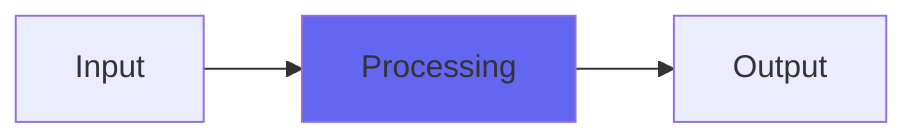

# StarChild2

## Quick Info

| | |
|---|---|
| **Category** | Ambience |
| **Type** | Ambience |
| **Status** | Latest Release |

## Description

a weird digital ambience/echo plugin adapted to high sample rates

## Detailed Overview

For all that we try to make plugins have natural, acoustic or electric, retro vibe qualities, sometimes there’s a thing which breaks the rules by creating a distinctive voice that has nothing to do with naturalness. I’ve got an old Alesis reverb like that: very primitive, but deep as anything. There have always been odd little boxes with a style all their own, like the Delta Labs Effectron, which is low-fi but uses delta-sigma modulation like an SACD (but much more crudely!)

In that spirit, here’s StarChild. The inspiration came from the old Ursa Major Space Station. That said, StarChild sounds nothing like a Space Station, but it does sound like it’s out of this world. Like Space Station, it produces series of echo taps which aren’t perfectly regular. Space Station has little rhythms that it does, while StarChild works on prime number sequences: that produces a sputtery sort of delay line in which it won’t reinforce any one frequency.

What you get is a curious delay/ambience effect, in stereo (it’ll widen stuff that’s only in the middle). It can work kind of like a natural ambience that’s a room in a horrible shape, or you can crank out the duration and get weird stretched textures with a variety of granularity. It’s an odd little plugin: didn’t sell that well in its earlier incarnation, yet this revised newer form is hotly anticipated: a bunch of people really started wanting it when Kagi (my payment processor) went out of business and suddenly it couldn’t be sold.

Now, years later, this is a version of it that's savvy to sample rates. It's undersampled so you can run at 96k or even 192k while getting the same delay times, the same sounds, and at more or less the same CPU load of the 44.1/48k version. It's been a while since we've seen this plugin, and rightfully so: it sounds really weird and bad! But that's exactly why you can make distinctive noises with it, and who's to say you don't want to sneak an ear-catching sound in there?

## Signal Flow

## How It Works

StarChild2 processes audio in the Ambience category. See the description above for specific functionality.

## Usage Tips

- Start with conservative settings
- A/B compare to hear the effect clearly
- Use in context with other processing
- Trust your ears over visual meters

## Related Plugins

Browse other [Ambience](../categories/ambience.md) plugins.

## Technical Details

**Source Code**: [View on GitHub](https://github.com/airwindows/airwindows/tree/master/plugins/LinuxVST/src/StarChild2)

**Categories**: Ambience

**Available Formats**:
- Mac AU
- Mac VST
- Windows VST
- Linux VST

## Resources

- [All Airwindows Plugins](../../README.md)
- [Category: Ambience](../categories/ambience.md)
- [Airwindows Website](https://www.airwindows.com)
- [Airwindows GitHub](https://github.com/airwindows/airwindows)

---

*Part of the Airwindows plugin collection - Open source audio processing plugins*

*Last updated: 2024*
