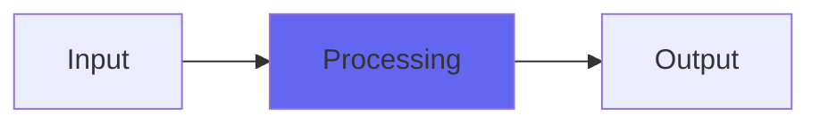

# StereoChorus

## Quick Info

| | |
|---|---|
| **Category** | Ambience |
| **Type** | Ambience |
| **Status** | Latest Release |

## Description

a nice basic stereo chorus

## Detailed Overview

Hi! This plugin is actually the one that kicked off the work that gave you StereoEnsemble. I got a request: please give me StereoChorus, like you used to have back in the Kagi days, I need to use it as nothing else will do.

It’s a bit funny as I didn’t remember it being that special. I mean, it’s got some odd tricks in the interpolation, it scales according to chorus speed so all the settings feel about equally intense, but it didn’t seem to me like anything that amazing, so I hadn’t got round to porting it to VST and open-sourcing it.

So now I have. It’s still got some of the interesting choices I made back when I coded it: for instance, it’s actually running a fixed point buffer at a rather long word length. Maybe this has something to do with the sound my user wanted to have back? However, I’ve added a few things. It’s now got modern dithering to floating point (on 32 bit busses) and I’ve added undersampling… so that it can sound the way it was meant to, even at elevated sample rates, while using lower CPU to do it. All in all it’s not the most outrageous plugin, but you know I’ve got folks fond of specifically it, and so I’ve brought it to VST form and open-sourced it just as it was, and maybe you too will find something special in it.

## Signal Flow

## How It Works

StereoChorus processes audio in the Ambience category. See the description above for specific functionality.

## Usage Tips

- Start with conservative settings
- A/B compare to hear the effect clearly
- Use in context with other processing
- Trust your ears over visual meters

## Related Plugins

Browse other [Ambience](../categories/ambience.md) plugins.

## Technical Details

**Source Code**: [View on GitHub](https://github.com/airwindows/airwindows/tree/master/plugins/LinuxVST/src/StereoChorus)

**Categories**: Ambience

**Available Formats**:
- Mac AU
- Mac VST
- Windows VST
- Linux VST

## Resources

- [All Airwindows Plugins](../../README.md)
- [Category: Ambience](../categories/ambience.md)
- [Airwindows Website](https://www.airwindows.com)
- [Airwindows GitHub](https://github.com/airwindows/airwindows)

---

*Part of the Airwindows plugin collection - Open source audio processing plugins*

*Last updated: 2024*
