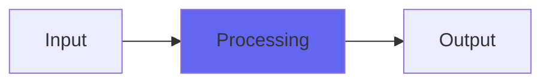

# StereoDoubler

## Quick Info

| | |
|---|---|
| **Category** | Ambience |
| **Type** | Ambience |
| **Status** | Latest Release |

## Description

like GlitchShifter optimized for pitch shift doubling and tripling

## Detailed Overview

StereoDoubler is another retro plugin I’ve had for a while, that is now available as open source and VST2 and M1 Mac and Raspberry Pi and so on. It’s using the basic concept of Glitch Shifter, so I should explain what that is first.

Glitch Shifter is my plugin for doing pitch shifting (and feedback on it, if you like) in a different way. Instead of smoothly interpolating over relatively small loops of sound to pitch shift, it works with potentially much larger loops, and searches for spots where it can seamlessly (or near-seamlessly) switch over without ever blending or blurring the sound. For that reason, it’s more up front and edgy, more personality, but it can also disconnect from the source audio in weird ways or glitch out like mad, hence the name.

StereoDoubler’s like two of those, tamed. Well, mostly tamed. It takes the source audio, and gives you a pitched-up version in one channel, a pitched-down version in the other, and lets you bring in dry for a center channel if you want. Because it’s still Glitch Shifter, it’ll give you faint ticking noises if it’s struggling to make its loops work, but it’s a lot tighter and more normal than Glitch Shifter usually is, and it’s simultaneously shifting up and down so the two sides will each have their own distinct glitch ‘personality’ while being as upfront and direct as they possibly can.

I hope you like it. Sometimes taking a wild experiment and reining it in a bit, is just the thing. StereoDoubler isn’t meant to work on every possible situation, it’s designed to be amazing when it’s in its element. Maybe your mix is its element :)

## Signal Flow

## How It Works

StereoDoubler processes audio in the Ambience category. See the description above for specific functionality.

## Usage Tips

- Start with conservative settings
- A/B compare to hear the effect clearly
- Use in context with other processing
- Trust your ears over visual meters

## Related Plugins

Browse other [Ambience](../categories/ambience.md) plugins.

## Technical Details

**Source Code**: [View on GitHub](https://github.com/airwindows/airwindows/tree/master/plugins/LinuxVST/src/StereoDoubler)

**Categories**: Ambience

**Available Formats**:
- Mac AU
- Mac VST
- Windows VST
- Linux VST

## Resources

- [All Airwindows Plugins](../../README.md)
- [Category: Ambience](../categories/ambience.md)
- [Airwindows Website](https://www.airwindows.com)
- [Airwindows GitHub](https://github.com/airwindows/airwindows)

---

*Part of the Airwindows plugin collection - Open source audio processing plugins*

*Last updated: 2024*
