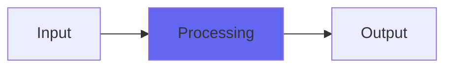

# StereoEnsemble

## Quick Info

| | |
|---|---|
| **Category** | Ambience |
| **Type** | Ambience |
| **Status** | Latest Release |

## Description

a sort of hyperchorus blast from the past

## Detailed Overview

StereoEnsemble is a blast from the past, updated with modern dithering to floating point and undersampling: bottom line is, this is a plugin that can take either a mono or a stereo input and give you a bunch of additional ensemble-y goodness, with particular attention to simulating stereo imaging through staggered delay pairs (making stuff be panned interestingly through adding echoes that have time offsets between left and right channels).

## Signal Flow

## How It Works

StereoEnsemble processes audio in the Ambience category. See the description above for specific functionality.

## Usage Tips

- Start with conservative settings
- A/B compare to hear the effect clearly
- Use in context with other processing
- Trust your ears over visual meters

## Related Plugins

Browse other [Ambience](../categories/ambience.md) plugins.

## Technical Details

**Source Code**: [View on GitHub](https://github.com/airwindows/airwindows/tree/master/plugins/LinuxVST/src/StereoEnsemble)

**Categories**: Ambience

**Available Formats**:
- Mac AU
- Mac VST
- Windows VST
- Linux VST

## Resources

- [All Airwindows Plugins](../../README.md)
- [Category: Ambience](../categories/ambience.md)
- [Airwindows Website](https://www.airwindows.com)
- [Airwindows GitHub](https://github.com/airwindows/airwindows)

---

*Part of the Airwindows plugin collection - Open source audio processing plugins*

*Last updated: 2024*
