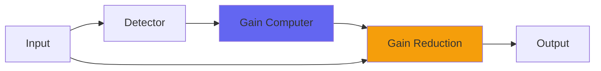

# StoneFireComp

 

## Quick Info

| | |
|---|---|
| **Category** | Dynamics |
| **Type** | Dynamics |
| **Status** | Latest Release |

## Description

some of the dynamics for ConsoleX

## Detailed Overview

This is new.

People have had compressors for a while (and you've just got a new one in Pop3). And people have had multiband compressors, and used them for both good and nefarious purposes. And technically, people have had Kalman filters, mostly because I made some and have had them out there for a while, both in the basic form and the 'air band' form I use for Air4.

But KALMAN multiband compression?

And yet, here we are. This is probably the trickiest aspect of ConsoleX, put out so you can come to terms with it (or, indeed, make a mess and a bunch of strange noises, while having no idea what's going on: that's cool too!)

This is two Pop3 compressors, run as a multiband filter, except the bandsplitter is a Kalman filter so it doesn't really work in terms of 'frequencies'. It works in terms of 'isolating sound qualities' and splits that, and then when you assemble the split audio again, if it balances perfectly you get the original sound back.

But if it doesn't balance, because for instance you've compressed both the parts in different ways? Well, that's when things get interesting.

You can isolate each part using the Fire and Stone controls: like in ConsoleX, they're unity gain at 0.5 and can be used to apply makeup gain to the compression. You can set the range control quite low so that Stone is basically kick and rumble, or quite high so that Fire is basically about brightness, or you can take a middle setting and fully use the strangeness of the crossover and the way it digs into transients and produces midrange in non-harmonic ways. Again, if you reassemble the parts perfectly, the strangeness goes away. But where's the fun in that?

I can only bring this much to Airwindows Consolidated, restricted to ten controls. ConsoleX is this plus gating and an air band (uncompressed) and separate ratios for all parts of both bands, plus sidechain EQ flavor boosts that are also uncompressed. This uses the same ratio control for both bands, and that's your secret for dialing back the strangeness and regaining control: you can crank Ratio to hear what StoneFireComp is doing, which could be nearly anything, and then turn it right down to apply appropriate amounts of your effect. In ConsoleX you do that and can also let through 'peeks' (peaks) of heavily filtered raw sound by way of equalization in the normal sense.

In line with my desire to make stuff that serves new purposes, that can be used for new musics and new kinds of sound, I honestly don't have that much advice on how to 'make classic sounds' using it. Or even, what sounds are good from it. I do know that using it subtly, with low ratio, should work better on the 2-buss, and that different sounds will end up needing different treatment, perhaps very different. But I don't know what will sound great yet, just that I suspect this can really find some interesting uses. Remember, Stone and Fire are distinct textures that recombine into the original sound perfectly, so combining their qualities with the qualities of compression should get you interesting results. Keeping settings similar will help it act 'normal'. Taking wild departures… won't.

Have fun, because ConsoleX is coming (though there is still a lot of work to do).

## Signal Flow

## How It Works

StoneFireComp controls dynamics through compression. The algorithm responds to your audio in a musical way, providing transparent to aggressive dynamic control.

## Usage Tips

- Start with gentle settings and increase as needed
- Use Dry/Wet for parallel compression if available
- Listen for pumping or artifacts
- A/B bypass to check if processing helps the mix

## Related Plugins

Browse other [Dynamics](../categories/dynamics.md) plugins.

## Technical Details

**Source Code**: [View on GitHub](https://github.com/airwindows/airwindows/tree/master/plugins/LinuxVST/src/StoneFireComp)

**Categories**: Dynamics

**Available Formats**:
- Mac AU
- Mac VST
- Windows VST
- Linux VST

## Resources

- [All Airwindows Plugins](../../README.md)
- [Category: Dynamics](../categories/dynamics.md)
- [Airwindows Website](https://www.airwindows.com)
- [Airwindows GitHub](https://github.com/airwindows/airwindows)

---

*Part of the Airwindows plugin collection - Open source audio processing plugins*

*Last updated: 2024*
