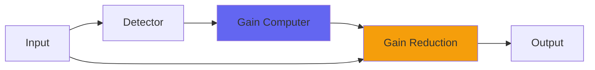

# SurgeTide

## Quick Info

| | |
|---|---|
| **Category** | Dynamics |
| **Type** | Dynamics |
| **Status** | Latest Release |

## Description

a surge and flow dynamics plugin

## Detailed Overview

This is a sort of dynamics plugin.

It comes from an experiment, where I had to find a way to make a behavior useful: SurgeTide runs on three different compression time constants stacked onto each other like the waves in an FM synthesizer. You don’t usually see a compressor work with the rate of the rate of the rate of change, because for normal sounds and time constants, the result sounds bizarre and unmusical.

BUT, it turns out if you set it up to run a very deep and slow change, like tidal forces on the mix, it can do really interesting things. You end up with a mix that seems totally uncompressed, because small variations just don’t alter the sound at all… but as the pressures of the music affect the compressor, it can ease off or boost volume.

And because the behavior’s so odd, it can react to an easing of pressure by swinging up very quickly. This behavior can be timed, sort of. You can end up with an effect that’s a little like EDM compressor pumping for effect, except it swings up to accentuate the downbeat. And not just the downbeat: a huge surge of bass underneath the downbeat. You can practically pull any degree of thump out of a track, but it’s tricky to dial in because mostly you can’t hear it working. It’s like an invisible size boost for subs.

The way to get SurgeTide working is to adjust the Surge Node until it squishes away the sound on the beat, then find the right speed for Surge Rate to work, and then back off Surge Node until it’s no longer inverting the dynamics. (unless you really want to: I’m not the boss of you.) It works really well as a subtle accentuation of mix low-end movement, giving some of the effect of a buss compressor but in an unusual and much cleaner way. Also works to subtly act as a level control and restrain dense mix moments so they can hit something like loudenation with more consistency.

It doesn’t work in any useful way on isolated tracks, particularly not staccato drum tracks: just maybe it would do helpful things with say, a lead vocal or a synth pad. Just remember that SurgeTide is for powerful, whole-mix movements rather than the usual compressor things, and that it can have effects on the extreme low bass, and build up the swing and flow of a mix. It’ll work on some things and be useless on others. I hope you like it.

## Signal Flow

## How It Works

SurgeTide controls dynamics through peak control. The algorithm responds to your audio in a musical way, providing transparent to aggressive dynamic control.

## Usage Tips

- Start with gentle settings and increase as needed
- Use Dry/Wet for parallel compression if available
- Listen for pumping or artifacts
- A/B bypass to check if processing helps the mix

## Related Plugins

Browse other [Dynamics](../categories/dynamics.md) plugins.

## Technical Details

**Source Code**: [View on GitHub](https://github.com/airwindows/airwindows/tree/master/plugins/LinuxVST/src/SurgeTide)

**Categories**: Dynamics

**Available Formats**:
- Mac AU
- Mac VST
- Windows VST
- Linux VST

## Resources

- [All Airwindows Plugins](../../README.md)
- [Category: Dynamics](../categories/dynamics.md)
- [Airwindows Website](https://www.airwindows.com)
- [Airwindows GitHub](https://github.com/airwindows/airwindows)

---

*Part of the Airwindows plugin collection - Open source audio processing plugins*

*Last updated: 2024*
