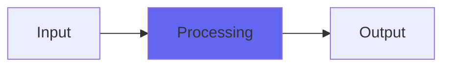

# TapeDelay

## Quick Info

| | |
|---|---|
| **Category** | Ambience |
| **Type** | Ambience |
| **Status** | Stable |

## Description

an old school tape echo with pitch swerve effects

## Detailed Overview

Tape Delay is the reissue (in updated and VST-ified form) of one of my first plugins. This is a precursor to Iron Oxide: it uses a technique for tone shaping that’s like a simplified Iron Oxide. Instead of being a direct EQ, it’s a huge cluster of delay taps, and also a little bit like a convolution impulse combined with an averaging: you get an averaging of just prime-numbered sample delay times. This turns out to work quite well (a direct version of this tone shaper by itself is also coming out)

The delay part is what makes this a fun toy. It can do some outlandish things, and also has some gotchas. It chases the delay setting in such a way that you get wild pitch bends from manipulating the control, not just buffer-smashings and dropouts. But, you also get buffer smashings and dropouts, so I wouldn’t dignify this with calling it ’emulation’: it’s just a way of fooling with the delay time control, live. If you’re rough with the control, it’ll get quite choppy. Also, if you intend to use this without glitches, you’ve got to enable the plugin and give it maybe a quarter or half second to chase to its desired setting, or you’ll hear a pitch zoop as the plugin starts up. That’s because this one starts at zero delay on reset, so if there’s audio happening it’ll get caught in the initial zip of the delay time.

If you can work with that, or don’t mind the weirdness, then you can enjoy this blast from the past that used to be AU-only for years and years: there’s a lot of interesting stuff like that, for instance Glitch Shifter. This one can give you mad dubby effects, either decaying into heavy Memory Man-like darkness or doing a tape slapback or decaying into bright airyness. Because of the prime-number based tone shaping, regeneration doesn’t produce reinforced artifacts, just continues to emphasize the tone shift you dialed in. (the tone-only version of this that’s coming, could be used in Blue Cat’s Late Replies plugin to make that a Tape Delay-alike, but without the delay time weirdness.)

Again, be careful using this on audio regions that are tightly trimmed to the very beginning of the sound: this one needs a second to stabilize if you’re using it to sound like a normal delay. Or, you can just do whatever you like :)

## Signal Flow

## How It Works

TapeDelay processes audio in the Ambience category. See the description above for specific functionality.

## Usage Tips

- Start with conservative settings
- A/B compare to hear the effect clearly
- Use in context with other processing
- Trust your ears over visual meters

## Related Plugins

Browse other [Ambience](../categories/ambience.md) plugins.

## Technical Details

**Source Code**: [View on GitHub](https://github.com/airwindows/airwindows/tree/master/plugins/LinuxVST/src/TapeDelay)

**Categories**: Ambience

**Available Formats**:
- Mac AU
- Mac VST
- Windows VST
- Linux VST

## Resources

- [All Airwindows Plugins](../../README.md)
- [Category: Ambience](../categories/ambience.md)
- [Airwindows Website](https://www.airwindows.com)
- [Airwindows GitHub](https://github.com/airwindows/airwindows)

---

*Part of the Airwindows plugin collection - Open source audio processing plugins*

*Last updated: 2024*
