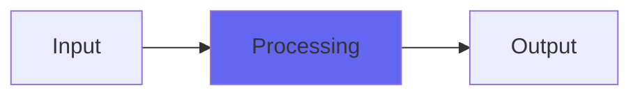

# TapeDelay2

 

## Quick Info

| | |
|---|---|
| **Category** | Ambience |
| **Type** | Ambience |
| **Status** | Latest Release |

## Description

a new implementation of a flexible tape echo

## Detailed Overview

TapeDelay2 gives you substantial changes over my original TapeDelay. It’s no longer trying to do the ‘Iron Oxide’ style tone shaping the original one did. In fact, it’s not even a delay in the same sense as its predecessor.

Instead, it’s a brand new, undersampled, Airwindows-bandpassed monster ready to make a whole pile of very convincing sounds. As plugin delays go, this covers a big range of purposes.

You’ve got a nice long delay time that’s still available at higher sample rates, thanks to the undersampling techniques. The delay line (and the regeneration) makes use of Airwindows bandpasses, but only on the undersampled content: meaning that if you’ve got it set to very nearly full range (resonance of zero) it’ll give the same subtle highpassing and lowpassing no matter what sample rate you’re at (a normal bandpass would have to roll off closer to the sample rate’s Nyquist frequency, in other words it would let through too many highs to do a proper tape emulation). You can tighten the bandwidth by increasing resonance. You can adjust the region you’re highlighting. And you can still adjust the frequency control even when set to full wide, which gives you more of a tilt EQ. It really turned out to have a lot of flexibility, and there’s two separate bandpasses so that you can shape the overall tone and also focus in on the regenerations if you like. Vintage sounds in the classic Airwindows way, meaning ‘no overprocessing, just high fidelity clean and simple processing’. Also, the dry/wet operates like my recent reverbs: 50% means full dry AND full wet, so you can bring in subtle echoes without altering the gain of your underlying track. Use it like a kind of reverb, with whatever tone and resonance works for you!

And lastly, just to top it off, Tape Flutter. This is a new implementation that I’ve never tried before. Instead of a simple vibrato, in TapeDelay2 the flutter keys off the amplitude of the underlying track, making it a lot more wavery and irregular. Subtle effects are easily achieved in most settings, and crank it up for more of a warbly dirty-tape quality. It should be irregular enough to sound like real tape wobble. It’s done by modulating the tape speed… because unlike any previous Airwindows tape effect, TapeDelay2 works by taking a full-length tape loop and literally speeding it up, rather than trying to change the length of the delay in any way. So both the warble, and any manipulations you make to the delay time, act like messing with the pitch of a physical tape machine with a set record and playback head… which turns out to be the best way to do this :)

This is one of the good ones. Hope ya like it!

## Signal Flow

## How It Works

TapeDelay2 processes audio in the Ambience category. See the description above for specific functionality.

## Usage Tips

- Start with conservative settings
- A/B compare to hear the effect clearly
- Use in context with other processing
- Trust your ears over visual meters

## Related Plugins

Browse other [Ambience](../categories/ambience.md) plugins.

## Technical Details

**Source Code**: [View on GitHub](https://github.com/airwindows/airwindows/tree/master/plugins/LinuxVST/src/TapeDelay2)

**Categories**: Ambience

**Available Formats**:
- Mac AU
- Mac VST
- Windows VST
- Linux VST

## Resources

- [All Airwindows Plugins](../../README.md)
- [Category: Ambience](../categories/ambience.md)
- [Airwindows Website](https://www.airwindows.com)
- [Airwindows GitHub](https://github.com/airwindows/airwindows)

---

*Part of the Airwindows plugin collection - Open source audio processing plugins*

*Last updated: 2024*
