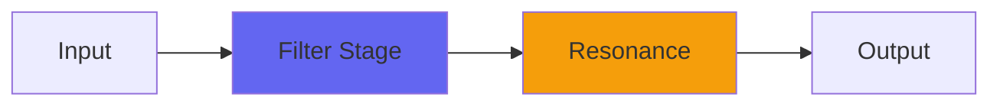

# TapeFat

## Quick Info

| | |
|---|---|
| **Category** | Filter |
| **Type** | Filter |
| **Status** | Stable |

## Description

the tone control from TapeDelay

## Detailed Overview

TapeFat is just the tone control from TapeDelay. It works like an averaging filter that you can use to either roll off highs (or eventually mids), or subtract the effect to create a highpass and take out the lows.

The reason this is interesting is, that tone control is completely bizarre. It’s an averaging filter, but on a pile of delay taps arranged according to prime numbers. Works more like an ambience control, but more densely packed. If you put an impulse through it you don’t get a smoothed-out lowpass so much as a bizarre micro-reverb. Since it’s using primes, it doesn’t reinforce any particular frequency. Since it’s an ambience, it doesn’t have any pre-echoes like linear phase EQs, and the artifacts it produces become a tone of their own (either in-phase, or inverted).

You can hear it on the video, which has a number of things updated, not least this: the new audio is directly captured analog sorta-house music out of my livestreams. This way you ought to be able to really hear the way my plugins retain analog qualities, because now the demo music is essentially AAD: not products of other DAW mixes or digital synthesis, but source material.

## Signal Flow

## How It Works

TapeFat shapes frequencies through filtering. Use it for tone shaping, problem solving, or creative sound design.

## Usage Tips

- Make small adjustments - EQ is powerful
- Cut first, boost second (if needed)
- Check your changes in context with the full mix
- Use solo to identify problem frequencies

## Related Plugins

Browse other [Filter](../categories/filter.md) plugins.

## Technical Details

**Source Code**: [View on GitHub](https://github.com/airwindows/airwindows/tree/master/plugins/LinuxVST/src/TapeFat)

**Categories**: Filter

**Available Formats**:
- Mac AU
- Mac VST
- Windows VST
- Linux VST

## Resources

- [All Airwindows Plugins](../../README.md)
- [Category: Filter](../categories/filter.md)
- [Airwindows Website](https://www.airwindows.com)
- [Airwindows GitHub](https://github.com/airwindows/airwindows)

---

*Part of the Airwindows plugin collection - Open source audio processing plugins*

*Last updated: 2024*
