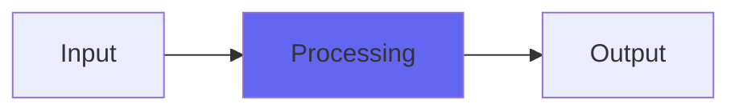

# TexturizeMS

## Quick Info

| | |
|---|---|
| **Category** | Noise |
| **Type** | Noise |
| **Status** | Latest Release |

## Description

a hidden-noise plugin for adding mid-side sonic texture to things

## Detailed Overview

This is further development on my earlier plugin, Texturize. It existed to blend sculpted noise with the direct signal in a way that can enhance the qualities of your audio… depending on what that was, and whether you liked the results. It 'does something', that's for sure, but what? My code for doing it already existed, but there was a lot of buzz over another plugin which did a variation of this effect with a great deal of mystery and hype. I thought it was useful to do an open source version where you could clearly hear what the thing did, and that's Texturize.

But what if a simple stereo effect isn't enough?

TexturizeMS breaks the effect into mid/side processing, and then lets you set them independently. That means you can add a bit of extra zip in the highs to just the side, while keeping the center cleaner. If you have synthetic elements that show obvious noise using Texturize, and they're centered, you can tune just the middle. I think it's a major upgrade in terms of actually using the effect usefully.

It's still Texturize. It's still a sort of funky snake oil (or maybe truffle oil?) It's a flavor and is absolutely doing a thing, but you don't have to consider it useful. But if you liked the flavor and atmosphere of this one, I think it's your lucky day. Hope you like it!

## Signal Flow

## How It Works

TexturizeMS processes audio in the Noise category. See the description above for specific functionality.

## Usage Tips

- Start with conservative settings
- A/B compare to hear the effect clearly
- Use in context with other processing
- Trust your ears over visual meters

## Related Plugins

Browse other [Noise](../categories/noise.md) plugins.

## Technical Details

**Source Code**: [View on GitHub](https://github.com/airwindows/airwindows/tree/master/plugins/LinuxVST/src/TexturizeMS)

**Categories**: Noise

**Available Formats**:
- Mac AU
- Mac VST
- Windows VST
- Linux VST

## Resources

- [All Airwindows Plugins](../../README.md)
- [Category: Noise](../categories/noise.md)
- [Airwindows Website](https://www.airwindows.com)
- [Airwindows GitHub](https://github.com/airwindows/airwindows)

---

*Part of the Airwindows plugin collection - Open source audio processing plugins*

*Last updated: 2024*
