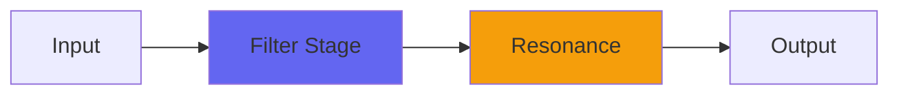

# ToneSlant

  

## Quick Info

| | |
|---|---|
| **Category** | Filter |
| **Type** | Filter |
| **Status** | Latest Release |

## Description

a super-transparent ‘tilt EQ’ with very low Q

## Detailed Overview

This is a new plugin, not a port from an existing Audio Unit. It’s based on a variation on the Average concept. Turns out, it’s the tail end of the ‘averaged samples block’ that causes the cancellation node. ToneSlant implements a much bigger sample block (100 taps) but linearly fades the samples off between the first and last sample in the block.

What that does, is produce an extremely transparent ’tilt EQ’ with a controllable corner point. And, it’s implemented in such a way that you can set it to null out (at extreme high boosts) and then bring in only the brightest highs (shown in the video). Quirky, maybe, but it broadens the ToneSlant toolkit. So, the main uses are:

-Extremely low Q treble rolloff above a set point (with a fixed dB/oct)

-That, plus you bring in the dry signal by not putting the Highs to an extreme (it’s like a positive/negative wet/dry/wet, but that doesn’t fit on the label, especially for VST)

-Total cancellation with Taps at 1 and Highs at +1, and then you put Taps to just barely greater than 1 and you can have a very natural high-shelf controllable with the Highs control

These come out of the algorithm: the reason it performs so well sonically is both the extremely low Q and the simplicity of the algorithm. Not everything I make belongs in a mastering studio, but ToneSlant is peculiarly suited to that use: it’s like those specialty EQs that have very few parts and impart no color to the sound. You should be careful applying ToneSlant, because it ‘hides’ and tries not to be apparent as EQ. Use it as such, when you need perhaps a strong ’tilt’ but don’t want the result to sound equalized.

## Signal Flow

## How It Works

ToneSlant shapes frequencies through filtering. Use it for tone shaping, problem solving, or creative sound design.

## Usage Tips

- Make small adjustments - EQ is powerful
- Cut first, boost second (if needed)
- Check your changes in context with the full mix
- Use solo to identify problem frequencies

## Related Plugins

Browse other [Filter](../categories/filter.md) plugins.

## Technical Details

**Source Code**: [View on GitHub](https://github.com/airwindows/airwindows/tree/master/plugins/LinuxVST/src/ToneSlant)

**Categories**: Filter

**Available Formats**:
- Mac AU
- Mac VST
- Windows VST
- Linux VST

## Resources

- [All Airwindows Plugins](../../README.md)
- [Category: Filter](../categories/filter.md)
- [Airwindows Website](https://www.airwindows.com)
- [Airwindows GitHub](https://github.com/airwindows/airwindows)

---

*Part of the Airwindows plugin collection - Open source audio processing plugins*

*Last updated: 2024*
