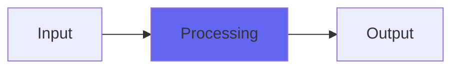

# TPDFWide

## Quick Info

| | |
|---|---|
| **Category** | Dithers |
| **Type** | Dithers |
| **Status** | Latest Release |

## Description

still TPDF dither but better and wider. With 16/24 bit output and a DeRez control

## Detailed Overview

TPDF is Triangular Probability Density Function. It’s about using two random sources of EXACTLY the right amplitude (one Least Significant Bit each) to render anything else, including the noise floor, free of quantization distortion so you can hear deeply INTO the noise floor and have it sound musical. Dither is important, and TPDF is the industry standard.

Me being Chris from Airwindows, I always manage to find a way to tweak things just a bit, and in my TPDF dither the randomness contrives to be added to the audio in such a way that it ‘leans’ a bit to one side of the waveform, while still being purely random noise sources of exactly the right amplitude. This causes the ultimate noise floor to be distributed over slightly more values than you’d get if it was perfectly lined up, at the expense of a teeny-tiny DC offset down about 12 db under the noise floor.

Turns out there’s more that can be done. If you have purely random sources, then your stereo channels will sometimes end up at the same random values. This is similar to the dither being in mono, which is known to narrow soundstage and hurt the sensation of wideness. But what if you could avoid that?

TPDFWide is purely random-source Triangular Probability Density Function dither, but once it’s rolled up its random numbers, it checks to see if the two channels came out the same (or close to the same). If they are… it rerolls a channel. If they still are… it rerolls the other channel. If they still are, it rerolls the first channel again, and then gives up so as not to hurt itself. In every case these are still random numbers: we’re just rejecting ones where they’re too mono.

And that gives us a ‘regulation’ TPDF dither that sounds better AND wider than generic, ordinary TPDF dithers. Firstly it covers just a slightly larger range at the noise floor, without actually being any louder. And secondly, it resists ‘mono dither’ which causes it to sound wider and more spatial than ordinary TPDF dithers. And yet it’s still a TPDF dither, at heart. If you would like something a little special, but don’t like my more unusual wordlength reduction techniques like NJAD or Spatialize or Dark or Beam etc. then you might enjoy TPDFWide. It has a ‘DeRez’ control that lets you go to low-bit realms and hear what the noise floor really sounds like, and it’s got 24 and 16 bit modes when you have DeRez set to 0 (which you should, for normal operation). You can use it as a 24 bit dither for monitoring and file-making, and as a 16 bit dither when you need to export to 16 bit. I hope you like it :)

## Signal Flow

## How It Works

TPDFWide processes audio in the Dithers category. See the description above for specific functionality.

## Usage Tips

- Start with conservative settings
- A/B compare to hear the effect clearly
- Use in context with other processing
- Trust your ears over visual meters

## Related Plugins

Browse other [Dithers](../categories/dithers.md) plugins.

## Technical Details

**Source Code**: [View on GitHub](https://github.com/airwindows/airwindows/tree/master/plugins/LinuxVST/src/TPDFWide)

**Categories**: Dithers

**Available Formats**:
- Mac AU
- Mac VST
- Windows VST
- Linux VST

## Resources

- [All Airwindows Plugins](../../README.md)
- [Category: Dithers](../categories/dithers.md)
- [Airwindows Website](https://www.airwindows.com)
- [Airwindows GitHub](https://github.com/airwindows/airwindows)

---

*Part of the Airwindows plugin collection - Open source audio processing plugins*

*Last updated: 2024*
