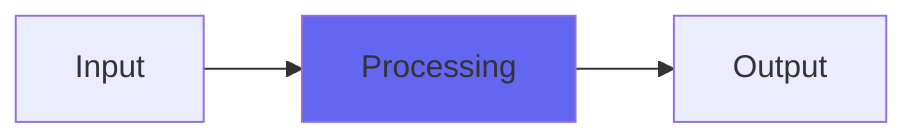

# TransDesk

## Quick Info

| | |
|---|---|
| **Category** | Subtlety |
| **Type** | Subtlety |
| **Status** | Stable |

## Description

more of a transistory, rock desk analog modeling

## Detailed Overview

Continue the look into classic Airwindows analog modeling with TransDesk!

There’s a famous analog console known for rock mixes. It might not have the preamplifiers to hang with the APIs and Neves of the world, but it’s been a watchword for mixdowns, both for the sound and for the extreme flexibility it offers (automation, effective EQ, compression). I’m not going to name it, but I was tuning TransDesk to get into a similar area: in particular, I wanted to get a comparable aggressiveness into the highs. This isn’t a plugin for making things soft and sweet, it’s for rocking out.

That said, there are many paths to this ocean of sonic mayhem, and what distinguishes TransDesk is that it gets its sound with very little processing. You don’t lose much mojo just to get that coat of sonic paint. In some ways the immediacy of this approach is closer to the analog truth. In other ways, it’s less a would-be clone of a classic big console, more a way to get some of that energy. (Technically, I’m doing it by trying to match the overload characteristics, including power supply idiosyncrasies that affect the way energy can be drawn for the highs.)

The result is another Desk-style plugin, with a completely different sound. It’s not calibrated to work with Console (that’s the for-pay version of Desk that consolidated these and calibrated them all) and it doesn’t have special requirements for where it should go. Place it where you want that style of tone coloring: like Desk, you can use it on auxes and submixes (including ones ‘inside’ Console) to better emulate running through a lot of circuitry.

## Signal Flow

## How It Works

TransDesk processes audio in the Subtlety category. See the description above for specific functionality.

## Usage Tips

- Start with conservative settings
- A/B compare to hear the effect clearly
- Use in context with other processing
- Trust your ears over visual meters

## Related Plugins

Browse other [Subtlety](../categories/subtlety.md) plugins.

## Technical Details

**Source Code**: [View on GitHub](https://github.com/airwindows/airwindows/tree/master/plugins/LinuxVST/src/TransDesk)

**Categories**: Subtlety

**Available Formats**:
- Mac AU
- Mac VST
- Windows VST
- Linux VST

## Resources

- [All Airwindows Plugins](../../README.md)
- [Category: Subtlety](../categories/subtlety.md)
- [Airwindows Website](https://www.airwindows.com)
- [Airwindows GitHub](https://github.com/airwindows/airwindows)

---

*Part of the Airwindows plugin collection - Open source audio processing plugins*

*Last updated: 2024*
