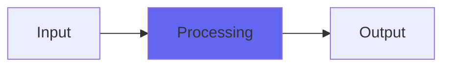

# Tremolo

  

## Quick Info

| | |
|---|---|
| **Category** | Effects |
| **Type** | Effects |
| **Status** | Latest Release |

## Description

fluctuating saturation curves for a tubey tremolo

## Detailed Overview

So, you’ve probably got a tremolo built in to your DAW.

But, if you’ve heard tremolo effects off classic records, it’s a whole different animal. DAW tremolos are neat little volume animations, capable of many cool effects (try making ’em squarewaves synced to the tempo for a nifty sequencey effect). But they don’t have that organic pulsating thing that takes a sound and gives it a whole new character.

So I made this!

This Tremolo uses saturation and antisaturation curves like you’d find in Density, and does the tremolo with that. It’s the same trick I use on the compressor ‘Pyewacket’. The result is, the loud parts develop a density and thickness mere volume won’t give you, and the lean parts hang on to a skeletal form of the transient attacks so your music comes through. This is not just ‘analog color’ like a coat of paint, Tremolo works quite differently from your DAW tremolo. It doesn’t sync to tempo, but that’s partly because I don’t know what to read (in AU and VST) that’d give me that information: could be added in future if the secrets are forthcoming, but there’s no sense withholding Tremolo just because of that!

## Signal Flow

## How It Works

Tremolo processes audio in the Effects category. See the description above for specific functionality.

## Usage Tips

- Start with conservative settings
- A/B compare to hear the effect clearly
- Use in context with other processing
- Trust your ears over visual meters

## Related Plugins

Browse other [Effects](../categories/effects.md) plugins.

## Technical Details

**Source Code**: [View on GitHub](https://github.com/airwindows/airwindows/tree/master/plugins/LinuxVST/src/Tremolo)

**Categories**: Effects

**Available Formats**:
- Mac AU
- Mac VST
- Windows VST
- Linux VST

## Resources

- [All Airwindows Plugins](../../README.md)
- [Category: Effects](../categories/effects.md)
- [Airwindows Website](https://www.airwindows.com)
- [Airwindows GitHub](https://github.com/airwindows/airwindows)

---

*Part of the Airwindows plugin collection - Open source audio processing plugins*

*Last updated: 2024*
