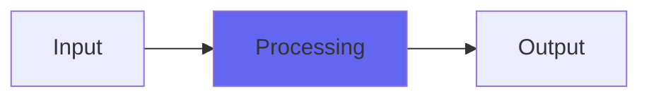

# TremoSquare

  

## Quick Info

| | |
|---|---|
| **Category** | Effects |
| **Type** | Effects |
| **Status** | Latest Release |

## Description

a squarewave tremolo effect that only switches on zero crossings

## Detailed Overview

Surprise! More sound design, texture-making, mix-blendering fun from Airwindows.

I meant to put out BassAmp today, but it’s not ready: needs more work. But I had this weird little critter handy, and so it’s skipping ahead whether you like it or not!

And that depends on what you get up to, signal processing wise. TremoSquare comes out of one of my livestreams, where I coded a plugin from scratch one Monday so people could watch the process. (I do that now.) It’s a squarewave tremolo, but it only transitions from silent to full volume on the zero crossings.

What that does, is firstly give the aggressive tremolo a nice warm coloration that doesn’t click or crackle, even on bassy sounds. But secondly, if you ramp up the frequency super high, it stops registering as a frequency because the crossings take precedence and interfere with the frequency of the transitions. So, you get a distinct sort of ‘de-rezzing’ effect that’s literally nothing but a tremolo, except it’s sculpted to be smoother and more graceful. It doesn’t tempo sync: think of it more like that effect on Bowie’s ‘Diamond Dogs’ album of singing through a fan that’s on. It’s got a dry/wet control so it can be faded in for effect, and the frequency range of the tremolo is extremely huge.

Hope you like it! I meant to do an entirely different plugin, but I just had this lying around…

## Signal Flow

## How It Works

TremoSquare processes audio in the Effects category. See the description above for specific functionality.

## Usage Tips

- Start with conservative settings
- A/B compare to hear the effect clearly
- Use in context with other processing
- Trust your ears over visual meters

## Related Plugins

Browse other [Effects](../categories/effects.md) plugins.

## Technical Details

**Source Code**: [View on GitHub](https://github.com/airwindows/airwindows/tree/master/plugins/LinuxVST/src/TremoSquare)

**Categories**: Effects

**Available Formats**:
- Mac AU
- Mac VST
- Windows VST
- Linux VST

## Resources

- [All Airwindows Plugins](../../README.md)
- [Category: Effects](../categories/effects.md)
- [Airwindows Website](https://www.airwindows.com)
- [Airwindows GitHub](https://github.com/airwindows/airwindows)

---

*Part of the Airwindows plugin collection - Open source audio processing plugins*

*Last updated: 2024*
