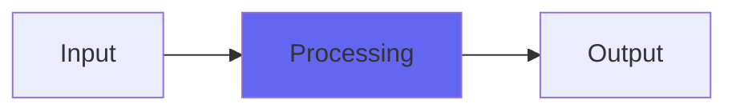

# TripleSpread

 

## Quick Info

| | |
|---|---|
| **Category** | Ambience |
| **Type** | Ambience |
| **Status** | Latest Release |

## Description

a stereo tripler with extra wideness and GlitchShifter processing

## Detailed Overview

Here’s a fun little toy that might make it into the toolkits of some otherwise non-Airwindows types :)

TripleSpread is based off the code of GlitchShifter, but it’s designed around one task, and that is the ‘split a track into three, pan one hard left and pitch it down a few cents, pan another hard right and pitch it up a few cents’. That’s what it does. It’s a tripler. Alternately, if you put it on a LR pair of instruments, it’ll double each of those instruments and stay very stereo. Or if you put it on an LCR submix, it can sound like about twelve instruments. That’s the specialty of TripleSpread: making a big wide stereo effect.

Except that it adds a new twist: as you bring up dry/wet, introducing the effect and progressively overpowering ‘dry’ (where the mono signal might be) it also fades out the mid content of the added stereo stuff. So you get a hyper-wide. Specifically, you get a hyper-wide that seamlessly fades between your clean, direct sound (however many sources you have in it) and the expanded, widened sound (adding pitch-shifted elements that are wider than the stereo field). These can be subtly pitch shifted, or nearly a semitone out if you crank it.

And if that’s not enough, it’s still Glitch Shifter based, so you can increase the tightness control until it glitches out or reverts to dry… or you can turn it way down, until the pitch shifted tripled voices hardly relate to the original sound at all. That might be cool for ambient pads, wide stereo synthetic things or what have you: it’ll add an unpredictable echoey effect that’s also pitch shifted. Tighten it up, and you control that vagueness as much as you like. Tighten it more, and you can tie it to whatever rhythmic element you like: it’s certainly capable of widening LCR guitars while keeping the ‘guitar orchestra’ effect relatively tight, or you can get silly and try it on percussive sounds as long as you’re OK with it either glitching, or blurring the timing.

So, the key distinction between this and StereoDoubler is that TripleSpread pushes the width of the added widening voices rather than just putting them hard left and hard right. You do that by pushing the dry/wet harder.

## Signal Flow

## How It Works

TripleSpread processes audio in the Ambience category. See the description above for specific functionality.

## Usage Tips

- Start with conservative settings
- A/B compare to hear the effect clearly
- Use in context with other processing
- Trust your ears over visual meters

## Related Plugins

Browse other [Ambience](../categories/ambience.md) plugins.

## Technical Details

**Source Code**: [View on GitHub](https://github.com/airwindows/airwindows/tree/master/plugins/LinuxVST/src/TripleSpread)

**Categories**: Ambience

**Available Formats**:
- Mac AU
- Mac VST
- Windows VST
- Linux VST

## Resources

- [All Airwindows Plugins](../../README.md)
- [Category: Ambience](../categories/ambience.md)
- [Airwindows Website](https://www.airwindows.com)
- [Airwindows GitHub](https://github.com/airwindows/airwindows)

---

*Part of the Airwindows plugin collection - Open source audio processing plugins*

*Last updated: 2024*
