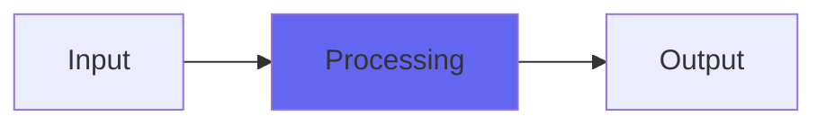

# TubeDesk

## Quick Info

| | |
|---|---|
| **Category** | Subtlety |
| **Type** | Subtlety |
| **Status** | Stable |

## Description

a tube recording console type tone coloring

## Detailed Overview

More classic Airwindows analog modeling with TubeDesk!

Tubes aren’t necessarily ‘mellow’. They’re also known for clarity, realism. TubeDesk isn’t a mud-ifier, but it might bring you some effects reminiscent of vintage recordings.

Like the other Desk plugins, it’s got a kind of saturation going on, a distinct flavor to how it distorts. However, unlike TransDesk, its power supply is very different. TubeDesk is so old school it acts like there’s a vintage tube rectifier, imparting an obvious rectifier sag. This conditions the sound, affecting how dynamics work through the plugin.

You have a distinct ‘analog modeling’ tone then, which is no specific console, no arbitrary color: just sort of retro vibe, generalized. It’s not calibrated to work with Console (that’s the for-pay version of Desk that consolidated these and calibrated them all) and it doesn’t have special requirements for where it should go. Place it where you want that style of tone coloring: like Desk, you can use it on auxes and submixes (including ones ‘inside’ Console) to better emulate running through a lot of circuitry.

## Signal Flow

## How It Works

TubeDesk processes audio in the Subtlety category. See the description above for specific functionality.

## Usage Tips

- Start with conservative settings
- A/B compare to hear the effect clearly
- Use in context with other processing
- Trust your ears over visual meters

## Related Plugins

Browse other [Subtlety](../categories/subtlety.md) plugins.

## Technical Details

**Source Code**: [View on GitHub](https://github.com/airwindows/airwindows/tree/master/plugins/LinuxVST/src/TubeDesk)

**Categories**: Subtlety

**Available Formats**:
- Mac AU
- Mac VST
- Windows VST
- Linux VST

## Resources

- [All Airwindows Plugins](../../README.md)
- [Category: Subtlety](../categories/subtlety.md)
- [Airwindows Website](https://www.airwindows.com)
- [Airwindows GitHub](https://github.com/airwindows/airwindows)

---

*Part of the Airwindows plugin collection - Open source audio processing plugins*

*Last updated: 2024*
