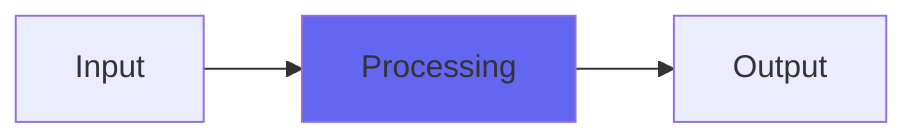

# VoiceOfTheStarship

## Quick Info

| | |
|---|---|
| **Category** | Noise |
| **Type** | Noise |
| **Status** | Latest Release |

## Description

a deep noise tone source

## Detailed Overview

This is the core of Noise, in maybe a more approachable form. The algorithm works like this: you do a random noise wander, where the audio output drifts around randomly with random amounts being added and subtracted from it. This is known as a random walk, and even if the amounts are equally positive and negative, the result will do two things: it'll give you more of a bassy rumble, and the loudest part of this bass will be a DC component. In other words, you can't use this directly for audio, because it won't make frequencies.

Voice Of The Starship uses a flipping variable to alternately add and subtract the randomness, which is what makes the amounts equally positive and negative, but it does one more thing: it runs another variable so that, periodically, it'll take a moment to check whether the output is above or below zero… and at that moment it will ALWAYS use the randomness to move toward zero.

This is enough to fix the DC problem, without adding a filter. (mind you, VOTS does also have lowpass filtering to help with the dark tonalities.) When you adjust Voice Of The Starship to have a less bassy noise, what you're doing is making it revert to zero more often, still with the simple randomness it's using.

This lets you go from regular noise to deep dark noise to purely subsonic rumble. I also used this algorithm for background ambience in my game Counterpart. Now it’s open source under the MIT license, so other game projects can have algorithmic noise (better and more flexible than wave files)

## Signal Flow

## How It Works

VoiceOfTheStarship processes audio in the Noise category. See the description above for specific functionality.

## Usage Tips

- Start with conservative settings
- A/B compare to hear the effect clearly
- Use in context with other processing
- Trust your ears over visual meters

## Related Plugins

Browse other [Noise](../categories/noise.md) plugins.

## Technical Details

**Source Code**: [View on GitHub](https://github.com/airwindows/airwindows/tree/master/plugins/LinuxVST/src/VoiceOfTheStarship)

**Categories**: Noise

**Available Formats**:
- Mac AU
- Mac VST
- Windows VST
- Linux VST

## Resources

- [All Airwindows Plugins](../../README.md)
- [Category: Noise](../categories/noise.md)
- [Airwindows Website](https://www.airwindows.com)
- [Airwindows GitHub](https://github.com/airwindows/airwindows)

---

*Part of the Airwindows plugin collection - Open source audio processing plugins*

*Last updated: 2024*
