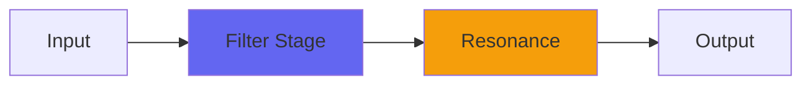

# Weight

 

## Quick Info

| | |
|---|---|
| **Category** | Filter |
| **Type** | Filter |
| **Status** | Latest Release |

## Description

a very accurate sub-bass boost based on Holt

## Detailed Overview

Weight is a plugin I made for me. Especially when I record live drums to simple stereo mics, or a DI bass, or indeed a guitar through an iso cab, I'll often want a little extra deep sub-bass. There's plenty of EQs I could reach for, to do that.

Recently I worked on Holt2, which Weight is based on, and I found it had an ability to bring up a really vivid, resonant bass boost. It's a somewhat nonlinear algorithm, and with Holt2 I added a bunch of stages, more poles of filtering, with controls for how much resonance you wanted to get to.

Weight just focuses on the 'very resonant' zone. I tuned it using Voxengo SPAN (as there's no specific formula for tuning this to any particular frequency, I had to discover what produced the right tunings) and set it up to gently go from pretty resonant, to very resonant at full crank. Weight can be tuned from 20 hz to 120 hz, which should cover a good range of sub-bass. The boost is to be applied by ear, and in many situations will be a change in character, not a big jump in overall bass level. The Weight control goes from 0 to 1, and unlike Holt it's not a dry/wet: it's added to what is otherwise a totally untouched signal, dry to dry-plus.

To use this, you should have extremely good subwoofers. I'm not convinced even the best headphones can really represent what this does. The Q of the filtering (zero latency, nonlinear, unusual) comes out so sharp that you can really hunt down finely grained distinctions of bass frequencies. My Monitoring plugins set to 'Subs' or the plugin SubsOnly, can help, by focusing in on the subs in a way that overdrives them and brings the harmonics up into the audible range. But you have to be able to hear what's being done because it's very specific.

The concept here is sub-bass boosting in 'areas of power' rather than just 'areas of preponderant energy' (thanks to 'Slipperman' for these concepts). To work with Weight, you will end up finding distinct frequencies for each instrument, in order to bring up subsonic weight in places where it is NOT already obvious. You'll not want to reinforce muddy deep stuff that's already there, Weight is for being able to focus in on spots where the muscle is, not just the rumble.

It's a specialty tool, though variations on it are very likely to appear in other things, perhaps alongside a much broader, more easy to hear bass control. You can have Weight now: hope you like it :)

## Signal Flow

## How It Works

Weight shapes frequencies through filtering. Use it for tone shaping, problem solving, or creative sound design.

## Usage Tips

- Make small adjustments - EQ is powerful
- Cut first, boost second (if needed)
- Check your changes in context with the full mix
- Use solo to identify problem frequencies

## Related Plugins

Browse other [Filter](../categories/filter.md) plugins.

## Technical Details

**Source Code**: [View on GitHub](https://github.com/airwindows/airwindows/tree/master/plugins/LinuxVST/src/Weight)

**Categories**: Filter

**Available Formats**:
- Mac AU
- Mac VST
- Windows VST
- Linux VST

## Resources

- [All Airwindows Plugins](../../README.md)
- [Category: Filter](../categories/filter.md)
- [Airwindows Website](https://www.airwindows.com)
- [Airwindows GitHub](https://github.com/airwindows/airwindows)

---

*Part of the Airwindows plugin collection - Open source audio processing plugins*

*Last updated: 2024*
