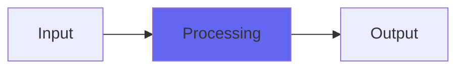

# XBandpass

 

## Quick Info

| | |
|---|---|
| **Category** | Utility |
| **Type** | Utility |
| **Status** | Latest Release |

## Description

a distorted digital EQ, inspired by retro sampler DSP

## Detailed Overview

Hi! This is the bandpass version of the X series Airwindows filters. If you know what a bandpass is you can probably figure out what’s going on here. More detail in the other filter types: the X filters mean experimental, and they're also written before I was interpolating coefficients, so these filters may produce zipper noise when adjusting them on the fly. However, that also means they are more CPU-efficient: it's a tradeoff.

## Signal Flow

## How It Works

XBandpass processes audio in the Utility category. See the description above for specific functionality.

## Usage Tips

- Start with conservative settings
- A/B compare to hear the effect clearly
- Use in context with other processing
- Trust your ears over visual meters

## Related Plugins

Browse other [Utility](../categories/utility.md) plugins.

## Technical Details

**Source Code**: [View on GitHub](https://github.com/airwindows/airwindows/tree/master/plugins/LinuxVST/src/XBandpass)

**Categories**: Utility

**Available Formats**:
- Mac AU
- Mac VST
- Windows VST
- Linux VST

## Resources

- [All Airwindows Plugins](../../README.md)
- [Category: Utility](../categories/utility.md)
- [Airwindows Website](https://www.airwindows.com)
- [Airwindows GitHub](https://github.com/airwindows/airwindows)

---

*Part of the Airwindows plugin collection - Open source audio processing plugins*

*Last updated: 2024*
