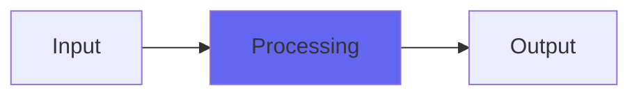

# XNotch

 

## Quick Info

| | |
|---|---|
| **Category** | XYZ Filters |
| **Type** | XYZ Filters |
| **Status** | Latest Release |

## Description

a distorted digital EQ, not as glitchy as the others

## Detailed Overview

This is a little different from some of the X series filters. I was asked whether I could do a notch filter like the other stuff I’d been doing: all these filters with Nuke controls that do crazy things when you distort them.

This is not quite like that.

XNotch is the same topology: biquad filters, with distortion stages in there. But instead of distorting inside the filter for crazy behavior and weird noises, this one distorts BETWEEN stages of filtering and that makes it act much more normal. So… why would I include it in the weird-zone with stuff like XHighpass?

Because the combination of those things and the dry/wet control makes it INCREDIBLY useful.

What you do is, for a sound source (for instance a kick drum mic), you dial in a notch where you want it. As you add input drive, or increase Nuke, the saturation will get more and more intense, but only apply to the stuff outside the notch. You can thicken up percussive sounds very well this way, or take drum overheads and focus on the treble sparkle by notching out midrange, or sweep it around for a phasey effect (this plugin is unusually well-behaved for automation, for some reason the notch biquad takes modulation better than usual) and then bring in dry to balance the intensity of the effect.

But if you’re using it to thicken up sounds, you can continue to push the saturation or Nuke while you’re doing that, which means you’re contouring both the tone and the compression of just the stuff you’re trying to enhance, and balancing it against a dry signal that’s effectively uncompressed/unsaturated. The real reason I knew I had to put this out just as it was, is because it became easy to just dial this stuff in, with very few controls, and no fuss.

It doesn’t do crazy things (unless you count allowing for heavy distortion) but the thing it does, is a thing I’ve been needing. I think it might replace Console7Cascade for some of my drum tracks, just because it can saturate and also notch, which will give me a way broader spectrum of available, useful tones.

And now you’ve got that, too :)

## Signal Flow

## How It Works

XNotch processes audio in the XYZ Filters category. See the description above for specific functionality.

## Usage Tips

- Start with conservative settings
- A/B compare to hear the effect clearly
- Use in context with other processing
- Trust your ears over visual meters

## Related Plugins

Browse other [XYZ Filters](../categories/xyz-filters.md) plugins.

## Technical Details

**Source Code**: [View on GitHub](https://github.com/airwindows/airwindows/tree/master/plugins/LinuxVST/src/XNotch)

**Categories**: XYZ Filters

**Available Formats**:
- Mac AU
- Mac VST
- Windows VST
- Linux VST

## Resources

- [All Airwindows Plugins](../../README.md)
- [Category: XYZ Filters](../categories/xyz-filters.md)
- [Airwindows Website](https://www.airwindows.com)
- [Airwindows GitHub](https://github.com/airwindows/airwindows)

---

*Part of the Airwindows plugin collection - Open source audio processing plugins*

*Last updated: 2024*
