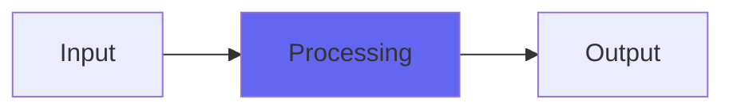

# YBandpass

 

## Quick Info

| | |
|---|---|
| **Category** | XYZ Filters |
| **Type** | XYZ Filters |
| **Status** | Latest Release |

## Description

soft and smooth to nasty, edgy texture-varying filtering

## Detailed Overview

YBandpass has various uses. One I was trying out in the video, was setting it up as a ‘walkie-talkie’ sort of tone on my voice, and then turning up ResEdge to really trash the hell out of the audio in a characteristic way that’s not easily found anywhere else. In some ways I think bandpassing is the ideal way to use ResEdge (but we’ll see: haven’t tried it on a Notch filter yet)

One day I’ll tell you all about all the things that have been going on behind the scenes here. For now, accept my next Y series filter, and I hope you enjoy it. I feel like the Z2 series (I’m leaving the original Z filters as they are because there’s uses for that too and they’re lower CPU, but will be doing V2 versions with the good coefficient interpolation for folks who craved absence of zipper noise) will be what folks are really excited about, but I do think these Y filters will have their place. They all give you the same characteristics with ResEdge, plus they all give you that slightly warm, unusual texture when you put ResEdge to 0 (a setting of 0.1 is what will give you closest to a traditional biquad, while still not quite being one)

## Signal Flow

## How It Works

YBandpass processes audio in the XYZ Filters category. See the description above for specific functionality.

## Usage Tips

- Start with conservative settings
- A/B compare to hear the effect clearly
- Use in context with other processing
- Trust your ears over visual meters

## Related Plugins

Browse other [XYZ Filters](../categories/xyz-filters.md) plugins.

## Technical Details

**Source Code**: [View on GitHub](https://github.com/airwindows/airwindows/tree/master/plugins/LinuxVST/src/YBandpass)

**Categories**: XYZ Filters

**Available Formats**:
- Mac AU
- Mac VST
- Windows VST
- Linux VST

## Resources

- [All Airwindows Plugins](../../README.md)
- [Category: XYZ Filters](../categories/xyz-filters.md)
- [Airwindows Website](https://www.airwindows.com)
- [Airwindows GitHub](https://github.com/airwindows/airwindows)

---

*Part of the Airwindows plugin collection - Open source audio processing plugins*

*Last updated: 2024*
