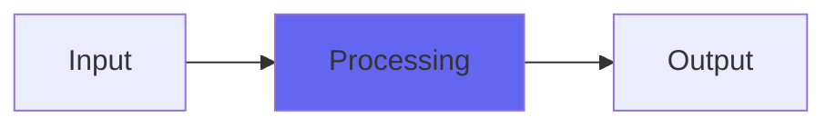

# YHighpass

 

## Quick Info

| | |
|---|---|
| **Category** | XYZ Filters |
| **Type** | XYZ Filters |
| **Status** | Latest Release |

## Description

soft and smooth to nasty, edgy texture-varying filtering

## Detailed Overview

See YLowpass, except it’s a highpass :) but there are several ‘one more things’, most notably an upgrade to what I’ve been using for denormalization. I ran into issues with YLowpass munching too much CPU. The fixes I came up with, worked so well, that I’ve applied them to Console7, Console7Cascade, Chamber, Galactic, and several plugins that haven’t come out yet :) As a result, my previous video using YLowpass crept up to 70% CPU at times, and this video using the exact same setup and plugins idles around 35%. I call that a good day (OK, week) of work.

## Signal Flow

## How It Works

YHighpass processes audio in the XYZ Filters category. See the description above for specific functionality.

## Usage Tips

- Start with conservative settings
- A/B compare to hear the effect clearly
- Use in context with other processing
- Trust your ears over visual meters

## Related Plugins

Browse other [XYZ Filters](../categories/xyz-filters.md) plugins.

## Technical Details

**Source Code**: [View on GitHub](https://github.com/airwindows/airwindows/tree/master/plugins/LinuxVST/src/YHighpass)

**Categories**: XYZ Filters

**Available Formats**:
- Mac AU
- Mac VST
- Windows VST
- Linux VST

## Resources

- [All Airwindows Plugins](../../README.md)
- [Category: XYZ Filters](../categories/xyz-filters.md)
- [Airwindows Website](https://www.airwindows.com)
- [Airwindows GitHub](https://github.com/airwindows/airwindows)

---

*Part of the Airwindows plugin collection - Open source audio processing plugins*

*Last updated: 2024*
