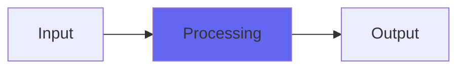

# YLowpass

 

## Quick Info

| | |
|---|---|
| **Category** | XYZ Filters |
| **Type** | XYZ Filters |
| **Status** | Latest Release |

## Description

soft and smooth to nasty, edgy texture-varying filtering

## Detailed Overview

Introducing the Y filters! Where the X filters were eXperimental and the Z filters are emulations meant to sound like hardware, YLowpass is further researches before going back into the Z filters for refinements. I’m using these to perfect the designs, and YLowpass is an important step in doing that.

It’s got interpolated coefficients on everything, reducing zipper noise. And double ultrasonic filtering. But it’s got a lot more than that: YLowpass introduces a new way to internally distort filters, and a new control… Resonant Edge! The ‘normal’ position for this is around 0.1 on the control. If you make it less, you get a slightly asymmetrical distortion that lets you get really warm analog filter sounds, even when they’re resonant. I stacked a couple of these up in the video to get Alpha Juno saturated filter sounds, that being one of my favorite analog synths, and I demonstrate it directly against the real authentic Alpha Juno run into the computer using API pres for input gain, an unmistakably analog tone. YLowpass holds up pretty well under that scrutiny. And then, I bring in a drum breakbeat, and start showing off how crazy YLowpass can get. The Resonant Edge lets you go to very aggressive, glitchy sounds that are a lot more like circuit bending than bit-banging.

I’ll be doing further Y series, and as I go I’ll be trying to refine the set every step of the way. For instance, in Bespoke I was getting some CPU issues (eagle-eyed viewers can see the CPU meter) since the Y filters will be rather heavy on the CPU. I’ve got some ideas for addressing this through adding an analog noise floor factor that could become part of Airwindows plugins as a general thing: experimentation will tell me the answers.

## Signal Flow

## How It Works

YLowpass processes audio in the XYZ Filters category. See the description above for specific functionality.

## Usage Tips

- Start with conservative settings
- A/B compare to hear the effect clearly
- Use in context with other processing
- Trust your ears over visual meters

## Related Plugins

Browse other [XYZ Filters](../categories/xyz-filters.md) plugins.

## Technical Details

**Source Code**: [View on GitHub](https://github.com/airwindows/airwindows/tree/master/plugins/LinuxVST/src/YLowpass)

**Categories**: XYZ Filters

**Available Formats**:
- Mac AU
- Mac VST
- Windows VST
- Linux VST

## Resources

- [All Airwindows Plugins](../../README.md)
- [Category: XYZ Filters](../categories/xyz-filters.md)
- [Airwindows Website](https://www.airwindows.com)
- [Airwindows GitHub](https://github.com/airwindows/airwindows)

---

*Part of the Airwindows plugin collection - Open source audio processing plugins*

*Last updated: 2024*
