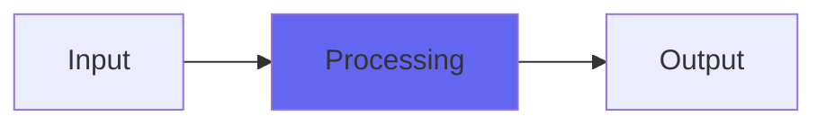

# YNotBandpass

## Quick Info

| | |
|---|---|
| **Category** | XYZ Filters |
| **Type** | XYZ Filters |
| **Status** | Stable |

## Description

soft and smooth to nasty, edgy texture-varying filtering, no control smoothing

## Detailed Overview

YNotBandpass has various uses. One I was trying out in the original video, was setting it up as a ‘walkie-talkie’ sort of tone on my voice, and then turning up ResEdge to really trash the hell out of the audio in a characteristic way that’s not easily found anywhere else.

In the video for YNotBandpass, the version without control smoothing, I demoed it on a bunch of huge reverb, alternating between a Bricasti Cathedral and my version of that same sound… and the more rapid switching between Freq settings turns out to sound pretty nice! Except when the ResEdge control is used to give a mean, electrical, circuit-bendy quality that still retains a lot of the depth of the underlying sound.

## Signal Flow

## How It Works

YNotBandpass processes audio in the XYZ Filters category. See the description above for specific functionality.

## Usage Tips

- Start with conservative settings
- A/B compare to hear the effect clearly
- Use in context with other processing
- Trust your ears over visual meters

## Related Plugins

Browse other [XYZ Filters](../categories/xyz-filters.md) plugins.

## Technical Details

**Source Code**: [View on GitHub](https://github.com/airwindows/airwindows/tree/master/plugins/LinuxVST/src/YNotBandpass)

**Categories**: XYZ Filters

**Available Formats**:
- Mac AU
- Mac VST
- Windows VST
- Linux VST

## Resources

- [All Airwindows Plugins](../../README.md)
- [Category: XYZ Filters](../categories/xyz-filters.md)
- [Airwindows Website](https://www.airwindows.com)
- [Airwindows GitHub](https://github.com/airwindows/airwindows)

---

*Part of the Airwindows plugin collection - Open source audio processing plugins*

*Last updated: 2024*
