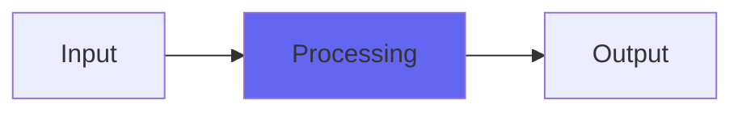

# YNotHighpass

## Quick Info

| | |
|---|---|
| **Category** | XYZ Filters |
| **Type** | XYZ Filters |
| **Status** | Stable |

## Description

soft and smooth to nasty, edgy texture-varying filtering, no control smoothing

## Detailed Overview

See YNotLowpass, except it’s a highpass :) interestingly, the original YHighpass saw some significant improvements in CPU usage. Turns out that going to YNot mode, with no control smoothing, boosts performance even more.

You can use YNotHighpass (or the control-smoothed version, YHighpass) to do a really unnatural, abrasive sweep up into the supersonic. It's not just about increasing resonance: the ResEdge does an unusual, nasty thing to the tone, and used as a highpass it's a really distinctive sound. I don't think it would work as a consistent part of anybody's tone for anything, but for that very reason it might be great as an unexpected move :)

Hope you like YNotHighpass, and I'm working on a whole bunch of more generally useful things that take longer to develop.

## Signal Flow

## How It Works

YNotHighpass processes audio in the XYZ Filters category. See the description above for specific functionality.

## Usage Tips

- Start with conservative settings
- A/B compare to hear the effect clearly
- Use in context with other processing
- Trust your ears over visual meters

## Related Plugins

Browse other [XYZ Filters](../categories/xyz-filters.md) plugins.

## Technical Details

**Source Code**: [View on GitHub](https://github.com/airwindows/airwindows/tree/master/plugins/LinuxVST/src/YNotHighpass)

**Categories**: XYZ Filters

**Available Formats**:
- Mac AU
- Mac VST
- Windows VST
- Linux VST

## Resources

- [All Airwindows Plugins](../../README.md)
- [Category: XYZ Filters](../categories/xyz-filters.md)
- [Airwindows Website](https://www.airwindows.com)
- [Airwindows GitHub](https://github.com/airwindows/airwindows)

---

*Part of the Airwindows plugin collection - Open source audio processing plugins*

*Last updated: 2024*
