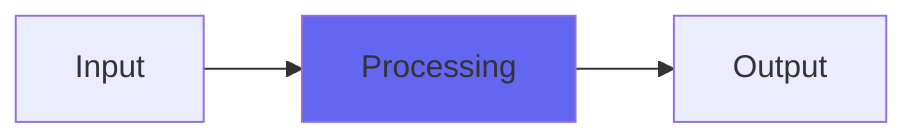

# ZHighpass

## Quick Info

| | |
|---|---|
| **Category** | XYZ Filters |
| **Type** | XYZ Filters |
| **Status** | Stable |

## Description

a highpass made to sound and act like the Emu e6400 Ultra highpass

## Detailed Overview

And here… we… go!

I picked the highpass to attempt first off the e6400 because it’s way harder. In recordings of the real unit, if you overdrive the samples you can hear how the machine flips out when you sweep the highpass up real high. Part of this is from the output stages of the device having characteristics not unlike Mackity: you get a strange overshoot, and that’s from the hardware.

These are not exactly ’emulations’ in the sense of stealing all the code out of the 6400 and then modeling the entire circuit and basically jacking the whole thing. That’s not what I do, and that stuff always ends up sounding very plastic to my ear (way too much overprocessing to try and get the fiddly details the same: you end up with a clone, but soulless)

Instead, ZHighpass is first in a series of Z-plugins, building on what I learned with the X series, and designed to act and respond the same as the real deal, but in the box. I got as close as I could with my own techniques, using some details (like where the filters hard-clip, and the likely Q factors) to zero in further. My hope is not as much that I’ve perfectly duplicated every detail of the hardware device… but that I made a plugin with enough of the soul of that device, that you can get equally musical results out of it. You should be able to USE ZHighpass much the way you’d use the real sampler and its genuine Z-Plane filters, to get filter swoops and voicings that deliver as much of the aggressive mojo you’d enjoy from the real thing.

Except that you can take it a little bit farther, and adjust it in ways not available on the real-deal sampler, to your taste. ‘Cos we’re not here just to clone what DnB maestros did in the Nineties. We’re playing with this particular sampler and mimicking some of its tricks because it turns out that was an amazing-sounding instrument, that gave you stuff typical DAW EQs don’t even come close to offering. And now, with ZHighpass, you can easily turn your DAW into that kind of instrument, on as many tracks as you like, anytime and anywhere you like.

And the cooling fan’s (probably) way quieter. And it’s easier to patch. Props to the real e6400 Ultra, though. You’ll be hearing more from that, in upcoming weeks.

## Signal Flow

## How It Works

ZHighpass processes audio in the XYZ Filters category. See the description above for specific functionality.

## Usage Tips

- Start with conservative settings
- A/B compare to hear the effect clearly
- Use in context with other processing
- Trust your ears over visual meters

## Related Plugins

Browse other [XYZ Filters](../categories/xyz-filters.md) plugins.

## Technical Details

**Source Code**: [View on GitHub](https://github.com/airwindows/airwindows/tree/master/plugins/LinuxVST/src/ZHighpass)

**Categories**: XYZ Filters

**Available Formats**:
- Mac AU
- Mac VST
- Windows VST
- Linux VST

## Resources

- [All Airwindows Plugins](../../README.md)
- [Category: XYZ Filters](../categories/xyz-filters.md)
- [Airwindows Website](https://www.airwindows.com)
- [Airwindows GitHub](https://github.com/airwindows/airwindows)

---

*Part of the Airwindows plugin collection - Open source audio processing plugins*

*Last updated: 2024*
