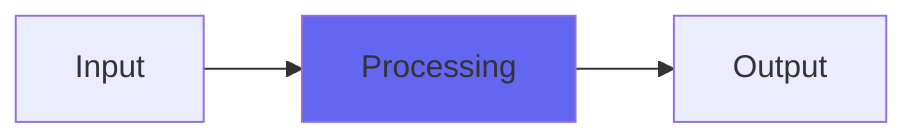

# ZNotch

## Quick Info

| | |
|---|---|
| **Category** | XYZ Filters |
| **Type** | XYZ Filters |
| **Status** | Stable |

## Description

a notch filter made to sound and act like the Emu e6400 Phaser

## Detailed Overview

And finally, the fourth filter type (I’m doing basic filters, not trying to compete with real Z-Plane releases), ZNotch!

This is made to sound like the Emu Phaser, which has notchlike qualities. At heart it’s an extension of the Airwindows Z series, not anything specifically Emu Z-Plane: I didn’t find a notch specifically in the Emu e6400 Ultra, but I thought the Phaser options were very notchlike, so I went for a take on those. You’ll get constant highs, the ability to notch out quite deep into the bass, and that overdrive that’s on tap in all the Airwindows Z plugins, plus the ability to do all that and then add that color, subtly, to the dry signal (do this by getting your distorted and notched tone just right, setting Poles to zero, turning the output up all the way and then bringing in just enough of the color that you can hear what it’s doing. Adjust to taste)

This concludes the DnB-inspired sampler emulation EQs. Hopefully this bank of four Z-plugins will be handy to reach for, in the box, to get those vivid tones and grinds… I suspect I’ll find ’em useful in the place of more ‘normal’ EQs simply because the character of the distortion will be so handy. You don’t have to distort them, but since they take a little overdrive so nicely they’ll serve a purpose in all kinds of slight overdrive, or character adding, situations. And since they’re the Z series, you’ll know where to find them even if you’ve installed ALL the Airwindows plugins (and you can do that… if you dare!)

## Signal Flow

## How It Works

ZNotch processes audio in the XYZ Filters category. See the description above for specific functionality.

## Usage Tips

- Start with conservative settings
- A/B compare to hear the effect clearly
- Use in context with other processing
- Trust your ears over visual meters

## Related Plugins

Browse other [XYZ Filters](../categories/xyz-filters.md) plugins.

## Technical Details

**Source Code**: [View on GitHub](https://github.com/airwindows/airwindows/tree/master/plugins/LinuxVST/src/ZNotch)

**Categories**: XYZ Filters

**Available Formats**:
- Mac AU
- Mac VST
- Windows VST
- Linux VST

## Resources

- [All Airwindows Plugins](../../README.md)
- [Category: XYZ Filters](../categories/xyz-filters.md)
- [Airwindows Website](https://www.airwindows.com)
- [Airwindows GitHub](https://github.com/airwindows/airwindows)

---

*Part of the Airwindows plugin collection - Open source audio processing plugins*

*Last updated: 2024*
