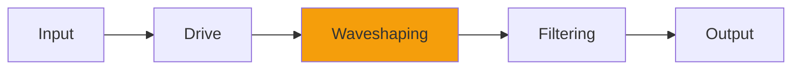

# ZOutputStage

## Quick Info

| | |
|---|---|
| **Category** | Distortion |
| **Type** | Distortion |
| **Status** | Latest Release |

## Description

the output clipping from the Emu e6400 style Z filters

## Detailed Overview

So I didn't get asked for this, exactly.

I got asked for the exciter setting out of the Emu e6400 Ultra. And this isn't it.

But I did have an exciter (and so have you, as it's in the plugin collection.) I'm sure it's weirder and twitchier than the Emu one, but it does exist. It just won't sound anything like that sampler, because the sampler has a lot of hardware on the analog outs, as well as being probably a totally different algorithm than mine, one that I have no idea how it's done.

Wait a second.

The reason I got asked for this was, drum and bass guys in the UK wanted to add some insane grind and energy, to basically synth waves. And I don't have the algo for that… but my exciter is nothing if not insane, and I did an output stage on the Z filters. That would apply exactly the same to an exciter, or anything else. I'd just do it as a simple distortion, except that rather than being a normal distortion it'd use the special filtering used in the Z filters to get that 'frizz' on the edges of clipped sounds that I clearly saw in the recordings of the real e6400. If it did that on distorting filters, it would do the same on an exciter, or anything.

And so I did :)

This goes after… well, anything. Whatever you like. Turn it up past 0.1 to distort, just like the Z filters. Turn the output way down because it's really hot. Apply to whatever digital mayhem you can wreak, and it should act a little more like it's coming off that sampler.

See ya next week :)

## Signal Flow

## How It Works

ZOutputStage adds harmonics and edge through distortion. Use it for adding grit, warmth, or aggressive processing.

## Usage Tips

- Start with conservative settings
- A/B compare to hear the effect clearly
- Use in context with other processing
- Trust your ears over visual meters

## Related Plugins

Browse other [Distortion](../categories/distortion.md) plugins.

## Technical Details

**Source Code**: [View on GitHub](https://github.com/airwindows/airwindows/tree/master/plugins/LinuxVST/src/ZOutputStage)

**Categories**: Distortion

**Available Formats**:
- Mac AU
- Mac VST
- Windows VST
- Linux VST

## Resources

- [All Airwindows Plugins](../../README.md)
- [Category: Distortion](../categories/distortion.md)
- [Airwindows Website](https://www.airwindows.com)
- [Airwindows GitHub](https://github.com/airwindows/airwindows)

---

*Part of the Airwindows plugin collection - Open source audio processing plugins*

*Last updated: 2024*
