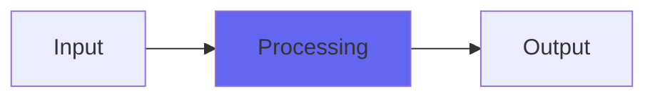

# ZRegion

## Quick Info

| | |
|---|---|
| **Category** | XYZ Filters |
| **Type** | XYZ Filters |
| **Status** | Stable |

## Description

an Emu e6400 style Airwindows Region filter

## Detailed Overview

Here's one I might be needing in future, so I'm putting it out for everybody to have!

The Airwindows Z series filters are kinds of digital filtering, with sampler hardware emulation put on 'em for added color and vividness, plus a staggering capacity for gain (folks using the original samplers often internally distorted sound with gain boosts in order to get maximum color out of the Emu filters).

But what if there's a filter type that didn't even exist on the original device?

ZRegion is that filter. The original Airwindows Region wasn't written in the context of an Emu Z emulation, more like just experimentation. It uses the cascading filter stages and distortions in an interesting way: you're using bandpass filters and distorting them, but Region lets you stagger the bandpass frequencies so that you're successively distorting through series of different filters. A bit hard to explain, but it lets you distort on midrangey frequencies and soften into the bass, or start out with bass clipping and then exaggerate that effect with higher frequencies.

The reason I might be needing this one is, I can get pretty killer bass tones using it. I'll set the first filter higher for midrange articulation, set the last filter very low for heavy bass mojo, and it's instantly a bass-amp type of sound. And if I intend to leave the setting as a fixed setting, ZRegion will give me that with the same flavor as my other Z filters.

But if I want to automate or move the controls as part of the mix…

## Signal Flow

## How It Works

ZRegion processes audio in the XYZ Filters category. See the description above for specific functionality.

## Usage Tips

- Start with conservative settings
- A/B compare to hear the effect clearly
- Use in context with other processing
- Trust your ears over visual meters

## Related Plugins

Browse other [XYZ Filters](../categories/xyz-filters.md) plugins.

## Technical Details

**Source Code**: [View on GitHub](https://github.com/airwindows/airwindows/tree/master/plugins/LinuxVST/src/ZRegion)

**Categories**: XYZ Filters

**Available Formats**:
- Mac AU
- Mac VST
- Windows VST
- Linux VST

## Resources

- [All Airwindows Plugins](../../README.md)
- [Category: XYZ Filters](../categories/xyz-filters.md)
- [Airwindows Website](https://www.airwindows.com)
- [Airwindows GitHub](https://github.com/airwindows/airwindows)

---

*Part of the Airwindows plugin collection - Open source audio processing plugins*

*Last updated: 2024*
